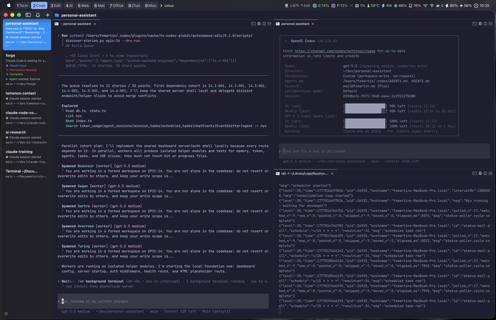

# claude-code-config

[](https://github.com/fxmartin/claude-code-config/actions/workflows/ci.yml)

A complete, opinionated Claude Code configuration: agents, skills, slash commands, MCP servers, hooks, and observability — engineered to take an idea from **one-line concept to merged PR without a human in the loop**.

This is the harness behind a multi-agent AGILE pipeline that runs on [cmux](https://www.cmux.dev/) (native macOS terminal for AI development) with full real-time visibility, parallel worktree execution, and automatic bug triage.

The harness ships as **two mirror plugins** — `autonomous-sdlc` for Claude Code (in this repo at `plugins/autonomous-sdlc/`) and `autonomous-sdlc` for Codex (in the sibling [`nix-install`](https://github.com/fxmartin/nix-install) repo). Same plugin name, same pipeline shape, same skill IDs — so the SDLC workflow is portable across both runtimes. On Claude Code the plugin's skills surface as bare slash-commands (`/brainstorm`, `/create-story`, etc.) labelled `(autonomous-sdlc)` in the autocomplete; on Codex they're invoked as `Use autonomous-sdlc <name>`.

We also use the Codex mirror as an automated adversarial review layer for Claude Code work. Claude Code remains the primary builder in this harness; Codex runs the same `autonomous-sdlc` plugin from the sibling repo to inspect Claude-produced changes, file high-signal issues, and challenge implementation quality from an independent runtime before work is considered done.

---

## What this harness achieves

```
 idea ─▶ /project-init ─▶ git repo + GitHub remote + labels + CLAUDE.md + PROJECT-SEED.md
         │
         ▼
     /brainstorm ─▶ REQUIREMENTS.md  (seed-aware: skips what /project-init already answered)
         │
         ▼
     /generate-epics ─▶ STORIES.md + epic-NN-*.md + NFRs
         │
         ▼
     /build-stories (parallel, autonomous)
         │  ├─ Discovery agent → dependency cohorts
         │  ├─ Build agents   (×5, worktree-isolated, TDD)
         │  ├─ Coverage gate  (×5, enforces 90%+)
         │  ├─ Review agent   (×5, senior-code-reviewer)
         │  └─ Merge agent    (sequential, rebase-before-merge)
         │      └─ Bugfix loop on failure (classify → fix → retry ×2)
         ▼
     E2E gate (Playwright, at epic boundaries)
         │
         ▼
     /project-review · /coverage · /create-project-summary-stats
```

Every phase emits structured events to a cmux sidebar pill + progress bar + ledger, and mirrors milestones to Telegram so long-running runs can be monitored away from the machine.

---

## The workflow, in five phases

### Phase 0 — Bootstrap (`/project-init`)

A lightweight bootstrapper for a brand-new repo. Turns an empty directory into a project the rest of the pipeline can consume — no more, no less.

Pre-flight checks gate the run: empty directory (dotfiles allowed), `gh` authenticated, no existing `.git/`. Then a **5-question interactive discovery** (objective, tech stack, architecture style, repo visibility, catch-all) — deliberately narrow. Database, testing, CI/CD, and deployment questions are **not** asked here; those belong to `/brainstorm`.

Output:

- `git init` + first commit
- GitHub remote created via `gh repo create` (public or private per your answer)
- **26 standard labels** applied (bug, enhancement, priority:*, epic:*, etc.) plus any project-specific ones
- `.gitignore` tailored to the detected tech stack
- **`CLAUDE.md`** — lightweight scaffold with placeholders for sections `/brainstorm` will fill in later (testing strategy, CI/CD, DB, deployment)
- **`PROJECT-SEED.md`** — structured handoff file that `/brainstorm` detects and reads to skip redundant questions

The skill closes by suggesting `/brainstorm` as the next step. If you already have a repo, skip Phase 0 — `/brainstorm` runs fine without a seed, just asks the full 8-question set from scratch.

### Phase 1 — Discovery (`/brainstorm`)

A Senior PM persona conducts a structured 8-question interview covering problem space, personas, success metrics, capabilities, scope boundaries, technical constraints, priority, and acceptance criteria. Output: `REQUIREMENTS.md`. If `PROJECT-SEED.md` exists (from `/project-init`), the interview skips questions already answered (objective, stack, architecture) and drills deeper into product/market fit — requirements, user problems, competitive landscape, success metrics. After the interview, `CLAUDE.md` is updated with any newly determined sections (testing, CI/CD, database, deployment).

### Phase 2 — Planning (`/generate-epics`, `/create-epic`)

Transforms `REQUIREMENTS.md` into a modular AGILE structure:

- `STORIES.md` — master overview
- `docs/stories/epic-NN-<name>.md` — INVEST-compliant user stories in `{Epic}.{Feature}-{NNN}` format
- `docs/stories/non-functional-requirements.md` — perf, security, reliability targets

`/create-epic` lets you add more epics interactively without redoing discovery.

### Phase 3 — Build

Two paths depending on how much control you want:

| Mode | Command | When to use |
|------|---------|-------------|
| **Controlled** | `/resume-build-agents <story-id\|epic\|next>` | One story at a time, visible agent selection, manual PR decisions |
| **Autonomous** | `/build-stories [all\|resume\|epic-NN] [--sequential]` | Full batch — parses the story graph, schedules cohorts, runs until done |
| **Issue-driven** | `/fix-issue <N\|url\|next\|all>` | 11-phase pipeline: investigate → build → coverage → review → E2E → merge → summary, with auto-classified bugfix retries |

#### The autonomous path: how `/build-stories` actually runs

The skill is a **thin dispatcher** — argument parsing, control flow, and structured-result parsing only. All heavy lifting is delegated to sub-agents, which preserves the orchestrator's context across 20+ story builds.

1. **Discovery agent** parses every epic file, resolves the dependency graph, topologically sorts it, and returns a `QUEUE_JSON` build queue.
2. **Cohort scheduler** groups stories whose dependencies are all complete into parallel cohorts (Cohort 1 = no deps; Cohort N = deps all in prior cohorts).
3. Each cohort runs through **4 stages**:

   ```
   Cohort N:
     Stage 1: [build A, B, C, D, E]     ← parallel, each in own git worktree (TDD)
     Stage 2: [coverage A, B, C, D, E]  ← parallel, adds tests to hit 90%+
     Stage 3: [review A, B, C, D, E]    ← parallel, senior-code-reviewer
     Stage 4: [merge A → B → C → D → E] ← sequential, rebase-before-merge
   ```

   

4. **Worktree isolation** (via the Agent tool's `isolation: "worktree"` flag) gives each concurrent agent a full, isolated checkout. No file-conflict races between agents working on overlapping areas of the codebase.
5. **Bugfix loop** — if any stage fails, a Bugfix Agent classifies the failure as `CODE_BUG` / `TEST_BUG` / `ENV_ISSUE`, files a GitHub issue, auto-fixes, and retries (max 2 attempts). Failed stories are marked `FAILED`; their dependents become `BLOCKED` in subsequent cohorts.
6. **E2E gate** at epic boundaries runs Playwright tests — blocking, warning, or off per flag.
7. **Summary agent** emits the run's metrics and a merged-PR manifest.

Progress is persisted in `docs/stories/.build-progress.md` (`DONE` / `IN_PROGRESS` / `FAILED` / `SKIPPED` / `PENDING`), so any run is resumable.

### Phase 4 — Quality & Intelligence

After build, the harness can audit itself:

| Command | Purpose |
|---------|---------|
| `/coverage` | Fill coverage gaps to 100% |
| `/design-e2e` | Generate Playwright E2E tests from acceptance criteria |
| `/execute-e2e-tests` | Run the E2E suite |
| `/project-review` | Full quality audit with scoring |
| `/create-project-summary-stats` | Metrics, retrospective, velocity |
| `/update-estimated-time-spent` | Dev velocity tracking |
| `/create-user-documentation` | Production-ready end-user docs |
| `/update-progress` · `/sync-progress` | Reconcile story status across files |

For adversarial review of Claude Code output, run the Codex mirror against the same repository after Claude finishes a build or fix. The preferred path is the Codex `autonomous-sdlc` plugin's review-oriented skills (`project-review`, `roast`, `coverage`, or `create-issue`) so findings come back as actionable issues rather than vague commentary.

The full workflow is documented end-to-end in [`WORKFLOW-v2.md`](WORKFLOW-v2.md).

---

## Why it works

- **Thin-dispatcher orchestrators** — skills like `/build-stories` and `/fix-issue` carry only control flow; heavy I/O and reasoning are delegated to sub-agents so the orchestrator's context window stays lean across tens of stories.
- **Specialist agents per story type** — the Build stage picks the right agent from the roster (`backend-typescript-architect`, `python-backend-engineer`, `ui-engineer`, `bash-zsh-macos-engineer`, `podman-container-architect`, `qa-engineer`) based on the story's tech stack.
- **Mandatory senior-code-reviewer** — every PR flows through an architecture/security review before merge. Not a nice-to-have, not optional.
- **TDD-first** — tests are written before implementation; the coverage gate fails the story if the final suite doesn't hit the threshold (default 90%).
- **Worktree isolation** — five agents can genuinely run in parallel without clobbering each other's files, because each has its own checkout.
- **Sequential merge with rebase** — Stage 4 serializes merges with rebase-before-merge, preventing the race conditions that kill naive parallel-merge setups.
- **Bugfix loop is a peer, not a god** — classifies failures, creates a GitHub issue (so there's an audit trail), fixes, retries. Two strikes and the story is marked `FAILED` rather than loop forever.
- **Verifiable goals** — every skill enforces strong success criteria per step (test green, coverage ≥ N, review approved, merge clean), which is what makes unattended loops safe.

---

## cmux observability layer

Runs without cmux work fine — all sidebar calls silently no-op when `$CMUX_SOCKET_PATH` is unset, and Telegram notifications fall through regardless.

With cmux, you get:

| Surface | What it shows |
|---------|---------------|
| **Status pills** | Current macro-phase (`Preflight`, `Discovery`, `Building`, `Summarizing`, `Complete`) + current sub-step (story ID, stage name) |
| **Progress bar** | Global run progress (`Cohort 2/4, Stage 3/4`, `5/18 stories`) |
| **Sidebar ledger** | Structured per-agent events: `BUILD_STARTED`, `TESTS_GREEN`, `BRANCH_PUSHED`, `COVERAGE_MEASURED`, `APPROVED`, `MERGED`, `BUILD_FAILED`, etc. — taggable with `--source story-<ID>` to trace a single story across all four stages |
| **Desktop notifications** | Milestones only (preflight failure, first story failure, E2E gate, finish) — never noisy |
| **Permission pill (red)** | Instant alert when a tool is blocked on approval |
| **Telegram envelope** | Start / first failure / E2E failure / abort / finish — gated to one-per-run for failures so your phone doesn't buzz 47 times during a bad run |

All of this routes through a single entry point, [`hooks/cmux-bridge.sh`](hooks/cmux-bridge.sh), with five subcommands (`status`, `progress`, `log`, `notify`, `clear`). Lifecycle hooks fire automatically — no per-skill configuration needed. See [`docs/cmux-integration.md`](docs/cmux-integration.md) for the full event schema and architecture.

---

## Hardware envelope

`build-stories --parallel` caps at **5 concurrent agents per stage**. That number isn't arbitrary — it's the ceiling on a **MacBook Pro M3 Max with 48 GB of unified memory**.

Each concurrent agent runs:

- Its own Claude Code process and agentic tool-use loop
- Its own git worktree (a full checkout of the repo on disk)
- Its own MCP server subprocesses (Playwright, context7, etc. as needed)
- Live language servers (tsc, pyright) spun up by the typescript/pyright plugins

At 5 agents × (Claude Code + MCP fleet + LSP + worktree I/O) the machine is sitting near memory pressure. Six would start swapping; seven would thrash. If you're running on less than 48 GB, drop the cap with `--sequential` or run narrower cohorts via `--limit=N`. This is the practical constraint that shapes the whole cohort model — not algorithm elegance, but RAM.

---

## What's in the repo

| Path | Description | Count |
|------|-------------|-------|
| `CLAUDE.md` | Global instructions loaded into every Claude Code session | 1 |
| `.claude-plugin/marketplace.json` | Local Claude Code marketplace manifest (registers the `autonomous-sdlc` plugin under the `fx-claude-config` marketplace) | 1 |
| `plugins/autonomous-sdlc/` | **Claude Code plugin** — SDLC skills surfaced as bare slash-commands labelled `(autonomous-sdlc)` (mirror of the Codex `autonomous-sdlc` plugin in `nix-install`) | 1 plugin / 8 skills |
| `skills/` | Loose user-level Claude skills not part of the SDLC plugin (generators, e2e, claude-docs, telegram, demo) | 9 |
| `commands/` | Namespaced slash commands (`dev/`, `devops/`, `issues/`, `project/`, `quality/`, `research/`) | 17 |
| `agents/` | Specialist agent definitions (flat) | 12 |
| `hooks/` | cmux lifecycle hooks, Telegram bridge, worktree bootstrap, PR-merge docs hook, orphan-worktree sweeper | 9 scripts |
| `scripts/` | Standalone validation scripts run by CI (`validate-agent-registry.sh`) | 1 |
| `tests/` | bats test suite for hooks and install smoke tests (cmux-bridge, install dry-run, agent-registry, sweep-orphan-worktrees) | 6 bats |
| `templates/` | Shared scaffolding used by generator skills | 3 |
| `reference-docs/` | Language/tooling references loaded via `@` imports | 3 |
| `docs/` | User-facing docs (cmux integration, CLAUDE.md guide, Python/container/DB/testing best practices, generators) | — |
| `settings.json` | Hooks config, statusline, enabled plugins, marketplaces | — |
| `statusline-command.sh` | Statusline renderer | — |
| `keybindings.json` | Keybindings override | — |
| `mcp/config.template.json` | MCP server template (env-var substituted at install) | — |
| `install.sh` | Portable symlink installer (`--skip-mcp`, `--skip-tools`, `--dry-run`, `--uninstall`) | — |

### Mirror plugins — `autonomous-sdlc` on both runtimes

The same plugin name ships on both platforms with overlapping but not identical skill sets. The shared core covers the user-facing SDLC chain (`project-init → brainstorm → generate-epics → create-epic → create-story → build-stories`); each side adds runtime-specific extras.

**Claude Code plugin** — `plugins/autonomous-sdlc/` in this repo (8 skills):

| Skill | Invocation |
|---|---|
| `project-init` | `/project-init [name]` |
| `brainstorm` | `/brainstorm [idea]` |
| `generate-epics` | `/generate-epics` |
| `create-epic` | `/create-epic <NN> [topic]` |
| `create-story` | `/create-story <NN> <description>` |
| `build-stories` | `/build-stories [story-id\|all]` |
| `fix-issue` | `/fix-issue [issue\|all\|next]` |
| `resume-build-agents` | `/resume-build-agents` |

**Codex plugin** — `plugins/autonomous-sdlc/` in the sibling [`nix-install`](https://github.com/fxmartin/nix-install) repo (15 skills):

- All 8 Claude skills above (same names, same purpose)
- Plus 7 Codex-only utilities: `check-releases`, `coverage`, `create-issue`, `create-project-summary-stats`, `plan-release-update`, `project-review`, `roast`
- Used as the adversarial review counterpart for Claude Code work: Codex can run `project-review`, `roast`, `coverage`, and `create-issue` against Claude-produced changes to catch bugs, missing tests, brittle assumptions, and integration regressions before merge.

The 7 Codex extras live as namespaced **commands** on the Claude side (`/devops:check-releases`, `/quality:roast`, etc.) under `commands/` rather than inside the plugin — so they're available everywhere, just at a different invocation path.

### Agent roster

| Agent | Specialization |
|-------|---------------|
| `backend-typescript-architect` | Bun runtime, advanced TypeScript, microservices |
| `python-backend-engineer` | FastAPI, uv, SQLAlchemy, async Python |
| `ui-engineer` | Modern frontend, component architecture, responsive design |
| `bash-zsh-macos-engineer` | macOS shell scripting, automation, CI/CD |
| `podman-container-architect` | OCI containers, multi-stage builds, rootless Podman |
| `qa-engineer` | Test strategy, quality metrics, defect management |
| `senior-code-reviewer` | Architecture validation, security audits, best practices |
| `meta-agent` | Generates new agent definitions |
| `crypto-coin-analyzer`, `crypto-market-agent` | Crypto market/ticker analysis |
| `executive-summary-generator`, `professional-profile-researcher` | Research workflows |

---

## Install

### Portable (any macOS / Linux)

```bash
git clone git@github.com:fxmartin/claude-code-config.git
cd claude-code-config
cp .env.example .env          # Machine-specific values (e.g., BROWSER_PATH)
./install.sh
```

The installer symlinks from `~/.claude/` to this repo for `CLAUDE.md`, `agents/`, `commands/`, `skills/`, `reference-docs/`, `docs/`, `settings.json`, `statusline-command.sh`, `keybindings.json`, and `hooks/`. Optionally installs CLI tools (`yazi`, `bat`, `fd`, `rg`, `fzf`, `zoxide`, `jq`, `ffmpeg`, `imagemagick`, `poppler`, etc.) used across the skills.

```bash
./install.sh --skip-mcp       # Skip MCP config (Nix handles it on Nix boxes)
./install.sh --skip-tools     # Skip CLI tools
./install.sh --dry-run        # Preview
./install.sh --uninstall      # Remove symlinks
```

### As a submodule (Nix-managed machines)

Consumed at `config/claude-code-config/`. The Nix activation script handles symlinks and MCP config generation — run the installer with `--skip-mcp`.

### Claude Code plugin install

Two paths — pick one.

#### Option A — Install directly from GitHub (recommended for users)

No local clone needed. Inside any Claude Code session:

```text
/plugin marketplace add fxmartin/claude-code-config
/plugin install autonomous-sdlc@fx-claude-config
```

Claude Code clones the repo into `~/.claude/plugins/marketplaces/fx-claude-config/`, reads `.claude-plugin/marketplace.json`, and installs the `autonomous-sdlc` plugin from `./plugins/autonomous-sdlc`. Pull updates later with:

```text
/plugin marketplace update fx-claude-config
```

#### Option B — Local clone + symlink (dev workflow)

Use this if you're authoring or iterating on the plugin's skills — edits to `plugins/autonomous-sdlc/skills/<name>/SKILL.md` land live in Claude Code without re-installing. `./install.sh` symlinks `~/.claude/plugins/marketplaces/fx-claude-config/` → this checkout. After it runs once:

```text
/plugin marketplace add fx-claude-config
/plugin install autonomous-sdlc@fx-claude-config
```

#### Verify either path

```bash
jq '.plugins | keys' ~/.claude/plugins/installed_plugins.json
# expect: includes "autonomous-sdlc@fx-claude-config"
```

A new Claude Code session then surfaces the plugin's 8 skills as bare slash-commands (`/brainstorm`, `/create-story`, etc.) — typing `/auto` in the prompt also matches them via the `(autonomous-sdlc)` annotation.

### Codex plugin install

The Codex mirror lives in the sibling [`nix-install`](https://github.com/fxmartin/nix-install) repo at `plugins/autonomous-sdlc/`. For a home-level Codex install, register the local marketplace rooted at your home directory:

```bash
codex plugin marketplace add "$HOME"
```

The home-rooted marketplace file lives at:

```text
~/.agents/plugins/marketplace.json
```

and resolves:

```text
./plugins/autonomous-sdlc -> ~/plugins/autonomous-sdlc
```

If `~/plugins/autonomous-sdlc` is symlinked to the `nix-install` repo's plugin directory, Codex sessions will pick up future skill changes after a restart. If automatic install is not honored by the current Codex build, install the plugin once from `/plugins` inside Codex and keep using the shared plugin path on disk.

---

## Environment variables

Copy `.env.example` to `.env` and fill in:

| Variable | Purpose |
|----------|---------|
| `BROWSER_PATH` | Absolute path to a Chromium-based browser for the Playwright MCP server |
| `TELEGRAM_BOT_TOKEN` | Optional — enables Telegram notifications via `cmux-bridge.sh notify` and the `/telegram` skill |
| `TELEGRAM_CHAT_ID` | Optional — target chat for Telegram notifications |

---

## MCP servers

The portable install runs MCP servers via `npx`:

- **context7** — up-to-date library documentation
- **playwright** — browser automation (E2E tests, UI verification)

On Nix machines, MCP servers use Nix-installed binaries instead of `npx`. Additional servers (Gamma, Gmail, Google Calendar/Drive) are configured separately and not part of this repo.

---

## Generator skills

Three skills for scaffolding new Claude Code components from within Claude Code:

```bash
/create-command "generate changelog entries"    # Create a slash command
/create-agent                                   # Interactive agent generator
/create-skill --scaffold "lint fixer"           # Skill scaffold with TODO placeholders
```

Each generator supports **interactive** (ask one question at a time), **direct** (generate from a description), and **scaffold** (minimal template with TODOs) modes. All three ask whether to install globally (this config repo) or locally (current project's `.claude/`), and include a review-before-write cycle.

See [`docs/generators.md`](docs/generators.md).

---

## Reference material

- [`CLAUDE.md`](CLAUDE.md) — global instructions loaded into every session (core principles, coding standards, CLI tool preferences, GitHub workflow)
- [`WORKFLOW-v2.md`](WORKFLOW-v2.md) — end-to-end workflow with cmux sidebar integration
- [`docs/claude-md-guide.md`](docs/claude-md-guide.md) — deep dive on CLAUDE.md structure, guardrails, and maintenance
- [`docs/cmux-integration.md`](docs/cmux-integration.md) — full cmux integration architecture and event schema
- [`docs/generators.md`](docs/generators.md) — generator skills documentation
- [`docs/python-best-practices.md`](docs/python-best-practices.md) · [`docs/testing-best-practices.md`](docs/testing-best-practices.md) · [`docs/container-best-practices.md`](docs/container-best-practices.md) · [`docs/database-best-practices.md`](docs/database-best-practices.md)

---

## Acknowledgements

Three external sources shaped this harness:

- **[forrestchang/andrej-karpathy-skills](https://github.com/forrestchang/andrej-karpathy-skills)** (MIT) — the *Surgical Changes* sub-rules, *Complexity check* heuristic, and *Verifiable Goals* plan template in [`CLAUDE.md`](CLAUDE.md) are adapted from this repo, which itself derives from Andrej Karpathy's observations on LLM coding pitfalls. Absorbed as prose rather than installed as a plugin, for single-source ownership.
- **[anthropics/skills](https://github.com/anthropics/skills)** — Anthropic's official example-skills marketplace, wired in via `settings.json`. Provides the `example-skills` plugin bundle (web-artifacts-builder, webapp-testing, frontend-design, canvas-design, algorithmic-art, skill-creator, claude-api, theme-factory, mcp-builder, docx/xlsx/pptx/pdf, brand-guidelines, internal-comms, doc-coauthoring, slack-gif-creator).
- **[cmux](https://www.cmux.dev/)** — native macOS terminal built on Ghostty for multi-agent AI development. The entire observability layer (sidebar pills, progress bar, structured ledger, desktop notifications, workspace management) is built against cmux's CLI via [`hooks/cmux-bridge.sh`](hooks/cmux-bridge.sh), with graceful degradation when cmux is absent.

---

## License

MIT — see [`LICENSE`](LICENSE).
