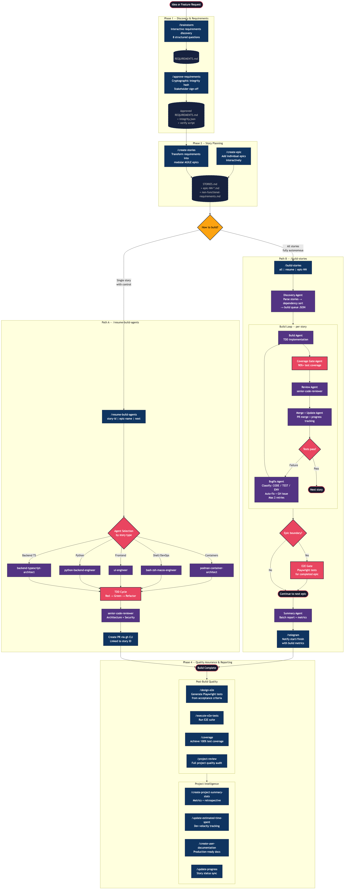

# Automated Design, Develop, Test Workflow

This document describes the end-to-end workflow for taking an idea from concept to deployed, tested, reviewed code using Claude Code's multi-agent orchestration system.

## Workflow Diagram

```mermaid
flowchart TD
    %% ── Styling ──
    classDef phase fill:#1a1a2e,stroke:#e94560,color:#fff,stroke-width:2px
    classDef skill fill:#0f3460,stroke:#16213e,color:#fff,stroke-width:1px
    classDef agent fill:#533483,stroke:#2b2d42,color:#fff,stroke-width:1px
    classDef gate fill:#e94560,stroke:#1a1a2e,color:#fff,stroke-width:2px
    classDef artifact fill:#16213e,stroke:#0f3460,color:#aaa,stroke-width:1px,stroke-dasharray:5 5
    classDef choice fill:#fca311,stroke:#14213d,color:#000,stroke-width:2px

    %% ── Phase 1: Discovery ──
    START([Idea or Feature Request]):::phase
    START --> BRAIN

    subgraph P1 [" Phase 1 — Discovery & Requirements "]
        BRAIN["/brainstorm\nInteractive requirements discovery\n8 structured questions"]:::skill
        BRAIN --> REQ_MD[(REQUIREMENTS.md)]:::artifact
        REQ_MD --> APPROVE["/approve-requirements\nCryptographic integrity hash\nStakeholder sign-off"]:::skill
        APPROVE --> REQ_SIGNED[(Approved REQUIREMENTS.md\n+ integrity.json\n+ verify script)]:::artifact
    end

    %% ── Phase 2: Planning ──
    REQ_SIGNED --> STORIES_GEN

    subgraph P2 [" Phase 2 — Story Planning "]
        STORIES_GEN["/create-stories\nTransform requirements into\nmodular AGILE epics"]:::skill
        STORIES_GEN --> STORY_FILES[(STORIES.md\n+ epic-NN-*.md\n+ non-functional-requirements.md)]:::artifact
        EPIC_ADD["/create-epic\nAdd individual epics\ninteractively"]:::skill
        EPIC_ADD --> STORY_FILES
    end

    %% ── Phase 3: Build Mode Choice ──
    STORY_FILES --> CHOICE{How to build?}:::choice

    %% ── Path A: Manual Control ──
    CHOICE -->|"Single story\nwith control"| RESUME

    subgraph P3A [" Path A — /resume-build-agents "]
        RESUME["/resume-build-agents\nstory-id | epic-name | next"]:::skill
        RESUME --> AGENT_SELECT{Agent Selection\nby story type}:::gate

        AGENT_SELECT -->|Backend TS| BE_TS[backend-typescript-architect]:::agent
        AGENT_SELECT -->|Python| PY[python-backend-engineer]:::agent
        AGENT_SELECT -->|Frontend| UI[ui-engineer]:::agent
        AGENT_SELECT -->|Shell/DevOps| BASH[bash-zsh-macos-engineer]:::agent
        AGENT_SELECT -->|Containers| POD[podman-container-architect]:::agent

        BE_TS & PY & UI & BASH & POD --> TDD

        TDD["TDD Cycle\nRed → Green → Refactor"]:::gate
        TDD --> REVIEW_A[senior-code-reviewer\nArchitecture + Security]:::agent
        REVIEW_A --> PR_A["Create PR via gh CLI\nLinked to story ID"]:::skill
    end

    %% ── Path B: Full Autonomy ──
    CHOICE -->|"All stories\nfully autonomous"| BUILD

    subgraph P3B [" Path B — /build-stories "]
        BUILD["/build-stories\nall | resume | epic-NN"]:::skill
        BUILD --> DISCOVER["Discovery Agent\nParse stories → dependency sort\n→ build queue (JSON)"]:::agent

        DISCOVER --> LOOP

        subgraph LOOP [" Build Loop — per story "]
            direction TB
            BUILD_AG["Build Agent\nTDD implementation"]:::agent
            BUILD_AG --> COV_GATE["Coverage Gate Agent\n90%+ test coverage"]:::gate
            COV_GATE --> REVIEW_B["Review Agent\nsenior-code-reviewer"]:::agent
            REVIEW_B --> MERGE["Merge + Update Agent\nPR merge → progress tracking"]:::agent
            MERGE --> BUGCHECK{Tests pass?}:::gate
            BUGCHECK -->|Failure| BUGFIX["Bugfix Agent\nClassify: CODE / TEST / ENV\nAuto-fix + GH issue\nMax 2 retries"]:::agent
            BUGFIX --> BUILD_AG
            BUGCHECK -->|Pass| NEXT_STORY([Next story]):::phase
        end

        LOOP --> E2E_CHECK{Epic boundary?}:::gate
        E2E_CHECK -->|Yes| E2E_GATE["E2E Gate\nPlaywright tests\nfor completed epic"]:::gate
        E2E_CHECK -->|No| CONTINUE([Continue to next epic]):::phase
        E2E_GATE --> CONTINUE

        CONTINUE --> SUMMARY["Summary Agent\nBatch report + metrics"]:::agent
        SUMMARY --> TELEGRAM["/telegram\nNotify start/finish\nwith build metrics"]:::skill
    end

    %% ── Phase 4: Quality & Reporting ──
    PR_A & TELEGRAM --> DONE

    subgraph P4 [" Phase 4 — Quality Assurance & Reporting "]
        DONE([Build Complete]):::phase
        DONE --> QA_OPTS

        subgraph QA_OPTS [" Post-Build Quality "]
            DESIGN_E2E["/design-e2e\nGenerate Playwright tests\nfrom acceptance criteria"]:::skill
            EXEC_E2E["/execute-e2e-tests\nRun E2E suite"]:::skill
            COVERAGE["/coverage\nAchieve 100% test coverage"]:::skill
            REVIEW_FINAL["/project-review\nFull project quality audit"]:::skill
        end

        QA_OPTS --> REPORT

        subgraph REPORT [" Project Intelligence "]
            STATS["/create-project-summary-stats\nMetrics & retrospective"]:::skill
            TIME["/update-estimated-time-spent\nDev velocity tracking"]:::skill
            DOCS["/create-user-documentation\nProduction-ready docs"]:::skill
            PROGRESS["/update-progress\nStory status sync"]:::skill
        end
    end
```



<details>
<summary>Mermaid source (click to expand)</summary>



</details>

## Phase 1 — Discovery & Requirements

| Step | Command | What happens |
|------|---------|-------------|
| 1 | `/brainstorm` | Interactive discovery session: 8 structured questions covering problem space, personas, success metrics, capabilities, scope boundaries, technical constraints, priority, and acceptance criteria. Produces `REQUIREMENTS.md`. |

**Alternative**: Use `/create-epic` to add individual epics interactively without going through full requirements discovery.

## Phase 2 — Story Planning

| Step | Command | What happens |
|------|---------|-------------|
| 2 | `/create-stories` | Transforms `REQUIREMENTS.md` into modular AGILE structure: `STORIES.md` overview, individual `epic-NN-*.md` files with INVEST-compliant user stories, and `non-functional-requirements.md`. |
| 2b | `/create-epic` *(optional)* | Adds individual epics interactively with 8-question discovery flow. Generates properly numbered stories following `{Epic}.{Feature}-{NNN}` format. |

## Phase 3 — Build

Two paths depending on desired control level:

### Path A: `/resume-build-agents` (Controlled)

For building **one story at a time** with visibility into agent selection and review.

```
/resume-build-agents <story-id | epic-name | next> [--skip-review] [--no-tests]
```

**Flow**:
1. Validates environment (clean git, STORIES.md exists, GitHub auth)
2. Auto-selects specialized agent based on story type and tech stack
3. Creates feature branch (`feature/$STORY_ID`)
4. Runs TDD cycle (Red, Green, Refactor)
5. Mandatory code review via `senior-code-reviewer`
6. Creates PR linked to story ID

**Available agents**: `backend-typescript-architect`, `python-backend-engineer`, `ui-engineer`, `bash-zsh-macos-engineer`, `podman-container-architect`, `qa-engineer`

### Path B: `/build-stories` (Fully Autonomous)

For building **all incomplete stories** across epics with automated error recovery.

```
/build-stories [all | resume | epic-NN | epic-name] [--dry-run] [--auto] [--skip-coverage] [--e2e-gate=block|warn|off]
```

**Flow per story**:
1. **Discovery Agent** — parses stories, resolves dependencies via topological sort, produces build queue
2. **Build Agent** — TDD implementation using the appropriate specialized agent
3. **Coverage Gate** — enforces 90%+ test coverage, adds missing tests
4. **Review Agent** — `senior-code-reviewer` validates architecture, security, performance
5. **Merge + Update Agent** — merges PR, updates progress tracking
6. **Bugfix Loop** — on failure, classifies as CODE_BUG / TEST_BUG / ENV_ISSUE, creates GitHub issue, auto-fixes (max 2 retries)
7. **E2E Gate** — runs Playwright tests at epic boundaries
8. **Summary Agent** — generates batch report with metrics
9. **Telegram notification** — posts start/finish with build metrics

**Progress tracking**: `docs/stories/.build-progress.md` maintains per-story status (DONE / IN_PROGRESS / FAILED / SKIPPED / PENDING).

## Phase 4 — Quality Assurance & Reporting

Post-build commands for additional quality gates and project intelligence:

| Command | Purpose |
|---------|---------|
| `/design-e2e` | Generate Playwright E2E tests from acceptance criteria |
| `/execute-e2e-tests` | Run the E2E test suite |
| `/coverage` | Analyze and fill test coverage gaps |
| `/project-review` | Full project quality audit with scoring |
| `/create-project-summary-stats` | Generate metrics and retrospective |
| `/update-estimated-time-spent` | Track development velocity |
| `/create-user-documentation` | Generate production-ready docs |
| `/update-progress` | Sync story status across files |

## Supporting Commands

| Category | Command | Purpose |
|----------|---------|---------|
| Issues | `/create-issue` | Create comprehensive GitHub issues with defect analysis |
| Issues | `/fix-github-issue` | Investigate and fix issues from GitHub |
| Quality | `/roast` | Brutal honest code assessment |
| DevOps | `/check-releases` | Monitor upstream dependency updates |
| DevOps | `/plan-release-update` | Plan Nix-based release updates |
| Generators | `/create-command` | Scaffold new slash commands |
| Generators | `/create-skill` | Scaffold new skills |
| Generators | `/create-agent` | Scaffold new agent definitions |

## Agent Roster

| Agent | Specialization |
|-------|---------------|
| `backend-typescript-architect` | Bun runtime, advanced TypeScript, microservices |
| `python-backend-engineer` | FastAPI, uv, SQLAlchemy, async Python |
| `ui-engineer` | Modern frontend, component architecture, responsive design |
| `bash-zsh-macos-engineer` | macOS shell scripting, automation, CI/CD |
| `podman-container-architect` | OCI containers, multi-stage builds, rootless Podman |
| `qa-engineer` | Test strategy, quality metrics, defect management |
| `senior-code-reviewer` | Architecture validation, security audits, best practices |
| `meta-agent` | Generates new agent definitions |

## Quick Reference

```bash
# Full workflow: idea → deployed code
/brainstorm                           # 1. Discover requirements
/create-stories                       # 2. Generate stories

# Then choose your build path:
/resume-build-agents next             # A. One story at a time (controlled)
/build-stories all                    # B. All stories (autonomous)

# Post-build quality:
/design-e2e epic-01                   # Generate E2E tests
/coverage                             # Fill coverage gaps
/create-project-summary-stats         # Generate retrospective
```
