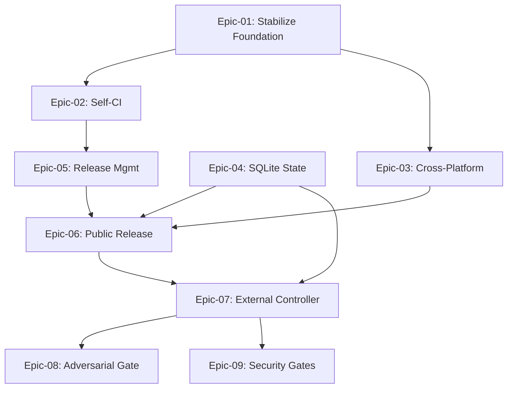

# USER STORIES: claude-code-config Sharing and Platform Roadmap

This is the master story index covering three progressive paths for the `claude-code-config` framework: foundation stabilization, MVP for team sharing (5 LTM colleagues on macOS and Windows-via-WSL2), and platform-grade roadmap items.

The MVP target is shareability: five LTM colleagues can install the framework on macOS or Windows-with-WSL2 in under 15 minutes, run `/brainstorm` then `/build-stories` on a fresh repo, and get working code, with cmux and Telegram both optional. Every commit to `main` produces a clean semver tag and an auto-generated GitHub Release. State survives crashes.

## User Personas

### Primary Personas

#### FX (Framework Owner)
- **Role**: Vice President Global Head of Sales, Banking Transformation, LTM. Builds and runs the framework on weekends.
- **Goals**: Ship a framework five LTM colleagues can install and use without help. Eventually evolve the framework into a reliable autonomous SDLC system that survives long-running unattended batches.
- **Pain Points**: Documentation drift between docs and code. Markdown-as-state losing data on long parallel runs. Manual release tracking. No tests on the framework itself. 613 MB of orphan worktrees from prior runs sitting on disk.

#### LTM Colleague (Early Adopter)
- **Role**: Sales engineer or solution architect inside LTM. Wants to automate dev side-projects with Claude Code, primarily as a productivity tool rather than a platform investment.
- **Goals**: Install in under 15 minutes. Run the autonomous build pipeline on a fresh repo and get a working PR. Optional dependencies (cmux, Telegram) never block the install or the first run.
- **Pain Points**: Mixed Mac and Windows fleet (WSL2 available on Windows boxes). Limited tolerance for failed installs or undocumented assumptions. No appetite to debug bash hooks.

### Secondary Personas

#### External Contributor (Post-MVP)
- **Role**: Advanced Claude Code user discovering the public repo after the LTM pilot.
- **Goals**: Read CHANGELOG, install cleanly, submit PRs that pass CI on first try.
- **Pain Points**: Undocumented assumptions about runtime, version drift between releases, no CI to validate contributions.

## Epic Overview

| Epic ID | Epic Name | Track | Story Count | Total Points | Priority | Status |
|---------|-----------|-------|-------------|--------------|----------|--------|
| Epic-01 | Stabilize Foundation | MVP-blocking | 5 | 13 | P0 | **COMPLETE** |
| Epic-02 | Self-CI for the Framework | MVP-blocking | 3 | 8 | P0 | **COMPLETE** |
| Epic-03 | Cross-Platform Installer (macOS + Windows/WSL2) | MVP | 4 | 13 | P0 | |
| Epic-04 | Durable State with SQLite | MVP | 4 | 18 | P1 | |
| Epic-05 | Automatic Release Management | MVP | 3 | 8 | P1 | |
| Epic-06 | Public Release Readiness | MVP | 4 | 11 | P1 | |
| Epic-07 | External Controller and Typed Contracts | Roadmap | 4 | 26 | P2 | |
| Epic-08 | Adversarial Gate and High-Risk Approval | Roadmap | 3 | 13 | P2 | |
| Epic-09 | Security Baked into Quality Gates | Roadmap | 3 | 10 | P2 | |

## Epic Navigation

- **[Epic-01: Stabilize Foundation](./epic-01-stabilize-foundation.md)** - Fix the bugs and drift surfaced by the multi-angle review (qa-expert vs qa-engineer, WORKFLOW.md, slash-name drift, Telegram JSON escape, worktree leak, `.env` source path).
- **[Epic-02: Self-CI for the Framework](./epic-02-self-ci.md)** - GitHub Actions: shellcheck, JSON schema validation, markdown link-check, bats tests, install dry-run smoke, agent-registry validator.
- **[Epic-03: Cross-Platform Installer](./epic-03-cross-platform-installer.md)** - Split the installer into modes. Document WSL2 path on Windows. Verify on clean machines of each platform.
- **[Epic-04: Durable State with SQLite](./epic-04-sqlite-state-ledger.md)** - Replace `.build-progress.md` as the truth source with SQLite. Keep markdown as the human-readable view.
- **[Epic-05: Automatic Release Management](./epic-05-release-management.md)** - Conventional Commits, commitlint on PRs, GitHub Actions semver bumper, auto-tag (`vX.Y.Z`), auto-generated GitHub Release notes, CHANGELOG maintenance.
- **[Epic-06: Public Release Readiness](./epic-06-public-release-readiness.md)** - CHANGELOG bootstrap, onboarding doc, five-user pilot smoke test, scope cleanup (separate personal agents from plugin).
- **[Epic-07: External Controller and Typed Contracts](./epic-07-external-controller.md)** *(Roadmap)*: Python or TypeScript CLI that owns the state machine; skills become workers with typed JSON-schema I/O contracts.
- **[Epic-08: Adversarial Gate and High-Risk Approval](./epic-08-adversarial-gate.md)** *(Roadmap)*: Vendor-agnostic adversarial reviewer slot; mandatory human approval for changes touching auth, payments, migrations, infrastructure, secrets.
- **[Epic-09: Security Baked into Quality Gates](./epic-09-security-quality-gates.md)** *(Roadmap)*: SAST plus dependency plus secrets scanning embedded into the coverage stage so security is a gate, not a follow-up.

## MVP Summary

### MVP Criteria

The MVP is shippable when ALL of the following hold:

1. Five LTM colleagues can install the framework on macOS or Windows-with-WSL2 in under 15 minutes without contacting FX.
2. The autonomous build pipeline (`/build-stories`) runs end-to-end on a sample project, with cmux and Telegram both optional and never-blocking.
3. Every commit to `main` produces a clean semver tag (`vX.Y.Z`) and an auto-generated GitHub Release.
4. CI runs on every PR: shellcheck, JSON schema, markdown link-check, install dry-run, agent-registry validator.
5. State survives a mid-run crash: resuming a build picks up at the exact failed stage, with branch, PR number, and attempt count intact.
6. No reference in docs or skills points at a nonexistent file or agent.

### MVP Scope

| Track | Epics in MVP | Points |
|-------|--------------|--------|
| Foundation (must) | Epic-01, Epic-02 | 21 |
| Distribution (must) | Epic-03, Epic-06 | 24 |
| Durability (must) | Epic-04 | 18 |
| Release ops (must) | Epic-05 | 8 |
| **Total MVP** | **6 epics, 23 stories** | **71** |

### Out of MVP Scope

- Native PowerShell support on Windows (WSL2 only for MVP).
- External controller (Epic-07).
- Mandatory adversarial gate (Epic-08; MVP keeps it optional and documented as a slot).
- Security scans baked into coverage stage (Epic-09).
- Linux desktop distros, ARM Linux servers, Bash 3 (macOS default bash).

## Project Metrics

- **Total Epics**: 9
- **Total Stories**: 33
- **Total Story Points**: 120
- **MVP Stories**: 23 (71 pts)
- **Roadmap Stories**: 10 (49 pts)

## Story Dependencies

### Cross-Epic Dependencies

### Critical Path

`Epic-01 → Epic-02 → Epic-05 → Epic-06`

Foundation fixes unblock CI. CI unblocks reliable release tagging. Release tagging unblocks the 5-colleague pilot. Epic-03 (cross-platform installer) and Epic-04 (SQLite state) run in parallel to the critical path and converge at Epic-06.

### Recommended Sequencing

| Sprint | Focus | Epics in play |
|--------|-------|---------------|
| Sprint 1 | Foundation | Epic-01 in full, Epic-02 stories 2.1-001 and 2.1-002 |
| Sprint 2 | CI + Cross-platform | Epic-02 finish, Epic-03 in full |
| Sprint 3 | State + Release | Epic-04, Epic-05 |
| Sprint 4 | Public release | Epic-06, pilot run with five colleagues |
| Sprint 5+ | Roadmap | Epic-07, Epic-08, Epic-09 |

The roadmap epics are not committed to a sprint. They get scheduled after the LTM pilot returns feedback.
