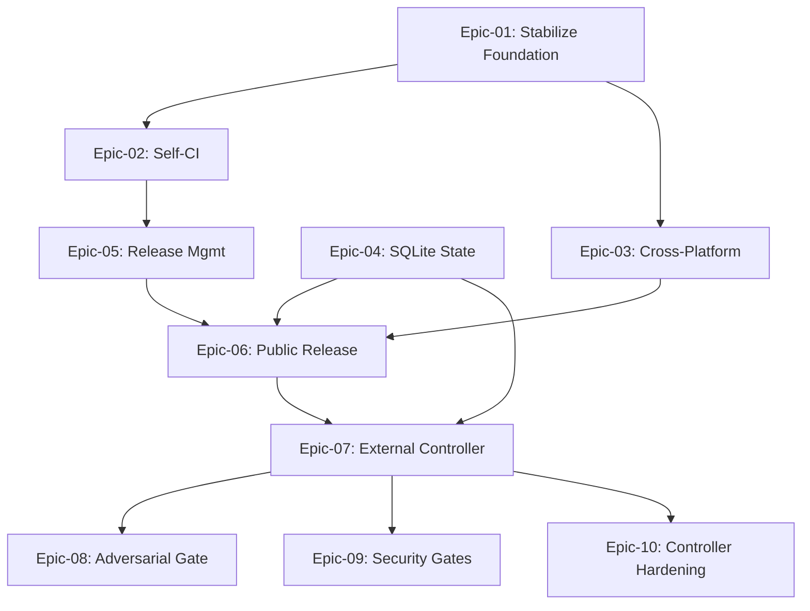

# USER STORIES: claude-code-config Sharing and Platform Roadmap

This is the master story index covering three progressive paths for the `claude-code-config` framework: foundation stabilization, MVP for team sharing (5 LTM colleagues on macOS and Windows-via-WSL2), and platform-grade roadmap items.

The MVP target is shareability: five LTM colleagues can install the framework on macOS or Windows-with-WSL2 in under 15 minutes, run `/brainstorm` then `/build-stories` on a fresh repo, and get working code, with cmux and Telegram both optional. Every commit to `main` produces a clean semver tag and an auto-generated GitHub Release. State survives crashes.

## User Personas

### Primary Personas

#### FX (Framework Owner)
- **Role**: Vice President Global Head of Sales, Banking Transformation, LTM. Builds and runs the framework on weekends.
- **Goals**: Ship a framework five LTM colleagues can install and use without help. Eventually evolve the framework into a reliable autonomous SDLC system that survives long-running unattended batches.
- **Pain Points**: Documentation drift between docs and code. Markdown-as-state losing data on long parallel runs. Manual release tracking. No tests on the framework itself. 613 MB of orphan worktrees from prior runs sitting on disk.

#### LTM Colleague (Early Adopter)
- **Role**: Sales engineer or solution architect inside LTM. Wants to automate dev side-projects with Claude Code, primarily as a productivity tool rather than a platform investment.
- **Goals**: Install in under 15 minutes. Run the autonomous build pipeline on a fresh repo and get a working PR. Optional dependencies (cmux, Telegram) never block the install or the first run.
- **Pain Points**: Mixed Mac and Windows fleet (WSL2 available on Windows boxes). Limited tolerance for failed installs or undocumented assumptions. No appetite to debug bash hooks.

### Secondary Personas

#### External Contributor (Post-MVP)
- **Role**: Advanced Claude Code user discovering the public repo after the LTM pilot.
- **Goals**: Read CHANGELOG, install cleanly, submit PRs that pass CI on first try.
- **Pain Points**: Undocumented assumptions about runtime, version drift between releases, no CI to validate contributions.

## Epic Overview

| Epic ID | Epic Name | Track | Story Count | Total Points | Priority | Status |
|---------|-----------|-------|-------------|--------------|----------|--------|
| Epic-01 | Stabilize Foundation | MVP-blocking | 5 | 13 | P0 | **COMPLETE** |
| Epic-02 | Self-CI for the Framework | MVP-blocking | 3 | 8 | P0 | **COMPLETE** |
| Epic-03 | Cross-Platform Installer (macOS + Windows/WSL2) | MVP | 4 | 13 | P0 | **COMPLETE** |
| Epic-04 | Durable State with SQLite | MVP | 4 | 18 | P1 | **COMPLETE** |
| Epic-05 | Automatic Release Management | MVP | 3 | 8 | P1 | **COMPLETE** |
| Epic-06 | Public Release Readiness | MVP | 4 | 9 | P1 | **COMPLETE**[^1] |
| Epic-07 | External Controller and Typed Contracts | Roadmap | 4 | 26 | P2 | **COMPLETE** (PRs #40-#43; E2E_PASS after bugfix #45) — `sdlc build`/`validate`/`sync-check` implemented; `init`/`resume`/`status`/`state`/`rollback` ship as [stubs](./epic-07-external-controller.md#deferred--stubbed-subcommands) |
| Epic-08 | Adversarial Gate and High-Risk Approval | Roadmap | 3 | 13 | P2 | **COMPLETE** (PRs #51, #52, #54) — adversarial slot + Codex reference impl + high-risk approval gate; gate approval fixed for solo/non-org repos via the `risk-approved` maintainer label ([#56](https://github.com/fxmartin/claude-code-config/pull/56)) |
| Epic-09 | Security Baked into Quality Gates + Live Pilot | Roadmap | 4 | 12 | P2 | **CODE-COMPLETE** (3/4) — SAST (#58), gitleaks (#59), osv-scanner (#60) merged, E2E_PASS; [9.3-001 live pilot](./epic-09-security-quality-gates.md#story-93-001-five-colleague-live-pilot) BLOCKED pending human pilot |
| Epic-10 | Controller Hardening (resume, observability, rollback) | Roadmap | 2 | 13 | P2 | **COMPLETE** (2/2) — 10.1-001 `resume`/`status`/`state` + a web `dashboard` (#66, #67, #70); 10.2-001 `rollback` + `init` removal (#71). All `sdlc` verbs implemented; no stubs remain |
| Epic-11 | Realtime Progress & Multi-Run Observability | Roadmap | 17 | 59 | P2 | **COMPLETE (17/17)** — all stories merged on `main` (PRs #78-#83 + dashboard batch through #154): realtime sub-stage/token streaming, multi-run registry + auto-refreshing dashboard, GitHub repo-health panel, wave-column dependency DAG (#140), live story status, transcript viewer, stable-height live regions, story titles, fix-issue runs |
| Epic-12 | Controller Robustness & Failure Recovery | Roadmap | 12 | 46 | P2 | **COMPLETE (12/12)** ([#72](https://github.com/fxmartin/claude-code-config/issues/72); PRs through #98) — all 12 stories merged on `main`: recover malformed result envelopes before parking, guard preflight against recursive hangs, non-destructive progress renderer, commit-message linting at commit time, auto-apply pending ledger migrations at launch; Feature 12.3/12.4 — honest run-terminal status (reconcile vs `origin/main`, `sdlc reconcile` verb, `AWAITING_APPROVAL` state, shared finalize helper) and branch-isolation (cut branches from `origin/main`); 12.5-001 dependency-line parser hardening; 12.2-004 compliant-commit-subjects-by-construction |
| Epic-13 | Agent Runtime Security Hardening | Roadmap | 5 | 19 | P2 | **COMPLETE (5/5)** (PRs #167-#171) — all stories merged on `main`: deny-rules for secret paths (#168), supply-chain scan of hooks/skills/MCP/settings (#171), untrusted-content sanitization (#167), kill-switch + heartbeat (#169), optional container sandbox (#170). Built in parallel (run 4fed56b0); 13.2-001 salvaged after a mid-run cmux-shim dispatch failure. From ECC `the-security-guide.md`. Created 2026-06-20 |
| Epic-14 | Cost & Model Governance | Roadmap | 6 | 23 | P2 | **COMPLETE (6/6)** (PRs through #114) — all stories merged on `main`: token-first budget gate, Max rate-limit/quota awareness with auto-resume on window reset, pre-dispatch usage estimate, per-task model routing (Balanced map: Haiku merge/discovery · Sonnet build/coverage/review · Opus high-risk + adversarial), cheap-first escalation on retry (#113), thinking-token cap (#114). From ECC `the-longform-guide.md`. Created 2026-06-20 |
| Epic-15 | Operability & Self-Service | Roadmap | 5 | 12 | P2 | **COMPLETE (5/5)** — all stories merged on `main` (2026-06-25): `sdlc clean` workspace GC (#174), `sdlc doctor` health-check (#175), `sdlc repair` (#176), hook profiles (#177), `status --markdown` handoff (#178). New read-side verbs so colleagues self-diagnose. From ECC operator tooling + the worktree-cleanup session. Created 2026-06-20 |
| Epic-16 | Continuous Learning / "Instincts" | Roadmap | 2 | 8 | P3 | **PLANNED (EXPERIMENTAL)** — spike: mine completed runs (ledger + git) for confidence-scored learnings; human-gated promotion to a skill/doc draft (never auto-installed). From ECC "instincts". Created 2026-06-20 |
| Epic-17 | True Parallel Story Execution | Roadmap | 5 | 19 | P2 | **COMPLETE (5/5)** (PRs #161-#165) — all stories merged on `main`: bounded concurrent executor (default 5, `--concurrency=N`), per-story git-worktree isolation, concurrency-safe ledger writes, truthful concurrency in status, and `mode` made authoritative. Validated end-to-end by the epic-13 parallel run (4 concurrent agents). From the epic-11 run post-mortem. Created 2026-06-20 |
| Epic-18 | Agent Output Quality — Evaluation & Simplicity | Roadmap | 5 | 21 | P2 | **COMPLETE (5/5)** — all stories merged on `main` (2026-06-25, parallel run c82ed1f3): reproducible agentic eval (#186), variant A/B + regression baselines (#187), eval-in-CI hook (#188), over-engineering review lens (#184), documentation-currency 18.3-001 (#185). From the ponytail analysis (philosophy already in CLAUDE.md). Created 2026-06-20 |
| Epic-19 | Controller UX & Ergonomics | Roadmap | 3 | 8 | P3 | **COMPLETE (3/3)** — all stories merged on `main` (2026-06-25, parallel run 1ac839c4): multi-epic build scope (`sdlc build epic-15 epic-18`, #193), a dashboard sidebar that distinguishes active runs from finished (#192), and a live progress bar/counter that credits parallel stories as each finishes (#194). Created 2026-06-25 |
| Epic-21 | Controller Self-Containment & Harness Selection | Roadmap | 3 | 8 | P2 | **COMPLETE (3/3)** — 21.1-001 ship config in the wheel (installed `sdlc` resolves its registry; was `None`) + 21.2-001 registry-level default-harness selector with `flag > repo file > registry default > claude` precedence and a commented claude/codex toggle (PR #239); 21.3-001 installer symlinks the Codex/Qwen adapters onto PATH so a Codex build needs no manual `ln -sf` (PR #241, risk-approved). All merged on `main` 2026-06-28. Surfaced wiring a repo to build on Codex. Created 2026-06-28 |
| Epic-22 | Centralized Story Tracking (GitHub/GitLab) | Roadmap | 11 | 47 | P2 | **COMPLETE (11/11)** — all 11 stories (22.1-001 → 22.6-001) implemented, tested, and merged: story inventory + migration, the `gh`/`glab` code-host adapter, host-aware issue rendering, idempotent story↔issue mapping, `sdlc issues init`/`sync`/`assign`, build-loop close-link + live status, developer-identity resolution, and the portfolio dashboard panel. Mirror every story across every epic to an issue + board on the configured code host (**GitHub** for FX's personal repos, **GitLab** for company work) so a multi-developer team has one shared "who's-doing-what / status" surface (the SQLite ledger is local-per-laptop and can't be shared). A field-directional projection, not a third master: MD owns the spec (managed issue block), the build/ledger owns status (`Closes #N`), the host owns ownership + discussion (assignee via `gh`/`glab` auth, cached back into the ledger). A thin code-host adapter swaps `gh`↔`glab`; `sdlc issues init` bootstraps the full board (done stories created-then-closed) for any repo; `sdlc issues assign` assigns a story or a whole epic (cascades to all its stories); a portfolio panel extends the Epic-11 dashboard. Running the *build pipeline* on GitLab (MRs, GitLab CI, release) is **Epic-23**. Created 2026-06-28 Epic-21 has since merged |
| Epic-23 | Pipeline on GitLab | Roadmap | 10 | 42 | P2 | **CODE-COMPLETE (9/10)** — 9 of 10 stories (23.1-001 → 23.6-002) implemented, tested, and merged (MR adapter, MR build loop, GitLab CI merge gate, release flow, `glab mr diff` review, auth/tokens, and the `sdlc doctor --gitlab` adoption preflight); only **23.7-001** (forge-agnostic dashboard repo-health) remains open. Run the autonomous *build pipeline* against GitLab company repos (the counterpart to Epic-22's issue mirror). Extends the Epic-22 code-host adapter from issue ops to **MR** ops: the build opens Merge Requests, gates the merge on **GitLab CI** pipeline status (the `gh pr checks` equivalent), merges + auto-closes the story issue, runs adversarial review via `glab mr diff`, and releases on GitLab CI (semver tag + GitLab Release, porting Epic-05). Ships a `.gitlab-ci.yml` quality-gate template (porting Epic-02/09 gates) + a `glab`-auth/CI-token model + an "adopt a GitLab project" preflight. Targets **GitLab Free/Core** (no Premium); the framework's own repo stays on GitHub. Created 2026-06-28 |
| Epic-20 | Cross-Harness SDLC Portability | Roadmap | 18 | 72 | P2 | **COMPLETE (18/18)** — original 13 merged on `main` (2026-06-27, parallel runs 68e5a36c/e4f9976c, PRs #200-#212): config-driven harness abstraction, per-role routing, Codex adapter, single-source skill generation, capability gating. **Feature 20.7 (5 stories)** added 2026-06-27 after cross-harness usage testing found three gaps shipped incomplete: per-role `--harness` routing was preflight/ledger-label only (it *labelled* the ledger but still ran `claude`), the Codex `build-stories` was never moved to the single-source generator, and per-stage model routing was Claude-only; plus a per-repo `.sdlc-harness.yaml` default. **20.7-001 wired routing into real dispatch, so per-role `--harness` is now functional** (a codex-routed stage dispatches the Codex adapter, not just a ledger label); all five 20.7 stories merged (PRs through #223). `fix-issue`/`resume-build-agents` stay Claude-only. Created 2026-06-26 |
| Epic-24 | Continuous Ready-Queue Scheduling | Roadmap | 1 | 5 | P2 | **PLANNED (0/1)** — retire the cohort barrier: dispatch each story the moment its own deps finish instead of waiting for its whole wave (continuous ready-queue / list scheduling), keeping `compute_cohorts` as the dashboard wave view. Surfaced live on the epic-23 run (23.2-001 idled behind unrelated same-wave 23.6-001) and realizes Epic-17's deferred "future enhancement, not this epic" Non-Goal. Created 2026-06-30 |
| Epic-25 | Reliable High-Risk-Block Recognition | Roadmap | 1 | 5 | P2 | **PLANNED (0/1)** — make `BLOCKED_HIGH_RISK` recognition deterministic so a merge blocked only by the approval gate parks as `AWAITING_APPROVAL` on the resume path too, never burning the bugfix loop or reading FAILED. Surfaced on the epic-23 resume (run 0541804d): 23.4-001 hit the same gate as 23.3-001/23.5-001 but was mislabeled FAILED instead of parked. Follow-up to 12.3-003. Created 2026-06-30 |
| Epic-26 | Agent Process Discipline (Superpowers-Inspired) | Roadmap | 4 | 13 | P3 | **PLANNED (0/4)** — import the agent-discipline patterns from obra/superpowers that the deterministic controller lacks: schema-enforced root-cause-first bugfix (`root_cause` in the bugfix contract + rationalization-table prompt), review-finding verification with a structured dispute channel (findings are claims, not orders), "do not trust the report" reviewer hardening, and RED/GREEN behavioral pressure-tests proving the discipline prompts change agent behavior. Orchestration explicitly not imported (Epic-07 replaced it); worktree submodule guard investigated and cleared. Created 2026-07-11 |
| Epic-27 | Performance & Token Optimization | Roadmap | 12 | 37 | P2 | **PLANNED (0/12)** — cut token consumption and wall-clock without weakening quality gates, grounded in measured data (212 stage logs, 472 session transcripts, live ledgers): the interactive/Agent-tool path runs **94% of token traffic on Opus** (fix-issue hardcodes it; agents inherit the session default), and quota backoff turned ~20-min stories into multi-hour outliers. Three features: kill the silent Opus default (fix-issue Balanced-profile alignment, `model: sonnet` agent frontmatter, prompt dedup/shrink/split), risk-tiered gates (docs-only skip coverage+adversarial, sonnet adversarial for low-risk with Opus floor for high-risk), and structural controller wins (deterministic coverage pre-check + controller-owned PR creation, story-section injection, pre-baked review packet, stall telemetry). Baseline + exit measurements in `docs/optimization/BASELINE.md`. Created 2026-07-11 |

## Epic Navigation

- **[Epic-01: Stabilize Foundation](./epic-01-stabilize-foundation.md)** - Fix the bugs and drift surfaced by the multi-angle review (qa-expert vs qa-engineer, WORKFLOW.md, slash-name drift, Telegram JSON escape, worktree leak, `.env` source path).
- **[Epic-02: Self-CI for the Framework](./epic-02-self-ci.md)** - GitHub Actions: shellcheck, JSON schema validation, markdown link-check, bats tests, install dry-run smoke, agent-registry validator.
- **[Epic-03: Cross-Platform Installer](./epic-03-cross-platform-installer.md)** - Split the installer into modes. Document WSL2 path on Windows. Verify on clean machines of each platform.
- **[Epic-04: Durable State with SQLite](./epic-04-sqlite-state-ledger.md)** - Replace `.build-progress.md` as the truth source with SQLite. Keep markdown as the human-readable view.
- **[Epic-05: Automatic Release Management](./epic-05-release-management.md)** - Conventional Commits, commitlint on PRs, GitHub Actions semver bumper, auto-tag (`vX.Y.Z`), auto-generated GitHub Release notes, CHANGELOG maintenance.
- **[Epic-06: Public Release Readiness](./epic-06-public-release-readiness.md)** - CHANGELOG bootstrap, onboarding doc, five-user pilot smoke test, scope cleanup (separate personal agents from plugin).
- **[Epic-07: External Controller and Typed Contracts](./epic-07-external-controller.md)** *(Roadmap)*: Python or TypeScript CLI that owns the state machine; skills become workers with typed JSON-schema I/O contracts.
- **[Epic-08: Adversarial Gate and High-Risk Approval](./epic-08-adversarial-gate.md)** *(Roadmap)*: Vendor-agnostic adversarial reviewer slot; mandatory human approval for changes touching auth, payments, migrations, infrastructure, secrets.
- **[Epic-09: Security Baked into Quality Gates](./epic-09-security-quality-gates.md)** *(Roadmap)*: SAST plus dependency plus secrets scanning embedded into the coverage stage so security is a gate, not a follow-up. Closes with the five-colleague live pilot (9.3-001, moved from Epic-06 on 2026-06-11) — the roadmap capstone that validates the finished platform.
- **[Epic-10: Controller Hardening](./epic-10-controller-hardening.md)** *(Roadmap)*: Implement the `sdlc` CLI verbs Epic-07 shipped as stubs — `resume` (controller-native crash recovery), `status`/`state` (observability), `rollback` (checkpoint unwind) — and retire or implement the redundant `init`. Created 2026-06-15.
- **[Epic-11: Realtime Progress & Multi-Run Observability](./epic-11-realtime-observability.md)** *(Roadmap)*: Stream agent stdout and emit fine-grained sub-stage events + running token/cost into the ledger (no more "captured output, invisible until stage completes"); a central run registry lets one auto-refreshing dashboard display every active run across repos. Created 2026-06-20.
- **[Epic-12: Controller Robustness & Failure Recovery](./epic-12-controller-robustness.md)** *(Roadmap)*: Make the controller resilient when a run goes sideways — recover a missing/malformed result envelope before parking work `NEEDS_ATTENTION`, guard preflight against recursive self-invocation hangs, keep the `.build-progress.md` renderer from clobbering non-ledger history, and lint agent commit messages at commit time. From issue #72 (epic-10 run post-mortem). Created 2026-06-20. Extended 2026-06-21 with Features 12.3/12.4 (honest run-terminal status that reconciles against `origin/main` so runs report DONE when work landed, an `AWAITING_APPROVAL` state for high-risk-gated merges, and branch-isolation to stop transitive landings) from the epic-11/12 mislabel post-mortem.
- **[Epic-13: Agent Runtime Security Hardening](./epic-13-agent-runtime-security.md)** *(Roadmap)*: Harden the *agent harness* (not the target code Epic-09 scans): a deny baseline for secret paths under `--dangerously-skip-permissions`, supply-chain scanning of hooks/skills/MCP/settings, untrusted-content sanitization before dispatch, a kill-switch + heartbeat for runaway agents, and an optional no-egress container sandbox. Inspired by ECC `the-security-guide.md`. Created 2026-06-20.
- **[Epic-14: Cost & Model Governance](./epic-14-cost-model-governance.md)** *(Roadmap)*: Make cost *enforceable* (per-run budget gate that pauses/aborts resumably; pre-dispatch estimate) and route models by task complexity/risk (Haiku/Sonnet/Opus), plus a thinking-token cap. Consumes Epic-11's token/cost accrual. Inspired by ECC `the-longform-guide.md`. Created 2026-06-20.
- **[Epic-15: Operability & Self-Service](./epic-15-operability-self-service.md)** *(Roadmap)*: New read-side verbs so the five colleagues self-diagnose instead of pinging FX — `sdlc doctor` (install/ledger/stuck-run/config/dependency health), `status --markdown` portable handoff, optional `sdlc repair`, and hook profiles. New verbs, so it lives here rather than Epic-12. Inspired by ECC operator tooling. Created 2026-06-20.
- **[Epic-16: Continuous Learning / "Instincts"](./epic-16-continuous-learning.md)** *(Roadmap, EXPERIMENTAL)*: A spike to mine completed runs (ledger + git history) for confidence-scored recurring patterns, then human-gated promotion of high-confidence learnings into reviewable skill/doc drafts — never auto-installed. Lowest priority; gated on the spike's go/no-go. Inspired by ECC "instincts". Created 2026-06-20.
- **[Epic-17: True Parallel Story Execution](./epic-17-parallel-execution.md)** *(Roadmap)*: The scheduler computes dependency cohorts but the executor runs stories one at a time — `mode=parallel` is a label nothing reads. Add a bounded concurrent executor (cohort-barrier, default 5 workers, `--concurrency=N`), per-story git-worktree isolation, concurrency-safe ledger writes, and truthful multi-active status. `--sequential` preserves today's serial path. From the epic-11 run post-mortem. Created 2026-06-20.
- **[Epic-18: Agent Output Quality — Evaluation & Simplicity](./epic-18-agent-output-quality.md)** *(Roadmap)*: Two capabilities we lack — a reproducible **agentic eval harness** (score agent output on LOC/tokens/cost/quality across real tickets; variant A/B; regression baselines; CI hook) to measure prompt/model/skill changes (incl. validating Epic-14 routing), and an **over-engineering review lens** that flags over-built code on each story's diff (advisory or route-to-simplify) — operationalizing the `CLAUDE.md` complexity-check where no human is in the loop. From the ponytail analysis; its philosophy was already ours. Created 2026-06-20.
- **[Epic-19: Controller UX & Ergonomics](./epic-19-controller-ux.md)** *(Roadmap)*: Quality-of-life fixes to the `sdlc` CLI + dashboard — multi-epic build/resume scope (`sdlc build epic-15 epic-18`), clearer active-vs-finished runs in the sidebar, and live per-story progress in parallel runs (the bar/counter credit each story as it finishes, not at the cohort barrier). From daily-use friction spotted during the Epic-15/18 builds. Created 2026-06-25.
- **[Epic-20: Cross-Harness SDLC Portability](./epic-20-cross-harness-portability.md)** *(Roadmap)*: Make the autonomous-sdlc pipeline run on harnesses beyond Claude Code (Codex first) by generalizing the controller dispatch + Epic-08 reviewer registry into a config-driven harness abstraction, with per-role harness routing (e.g. Claude builds while Codex reviews and QAs in one run), a single-source skill layer that generates the Claude and Codex skill files from one definition, and capability gating with safe degradation. `fix-issue`/`resume-build-agents` stay Claude-only by a documented boundary. Created 2026-06-26. **Feature 20.7 (2026-06-27)** completes it: wire `--harness` routing into real dispatch (it was a ledger label only), move the Codex `build-stories` onto the single-source generator, add per-harness per-stage model routing, and a per-repo `.sdlc-harness.yaml` default.
- **[Epic-21: Controller Self-Containment & Harness Selection](./epic-21-controller-self-containment.md)** *(Roadmap)*: Make the PATH-installed `sdlc` actually usable for cross-harness (Codex) builds outside the source checkout. Epic-20 made the pipeline cross-harness, but the installed tool loaded its config from a source-tree path that does not exist in a `uv tool install`ed wheel — so it found no harness registry and Codex routing failed. Ship the controller config inside the wheel via `importlib.resources` (21.1-001), wire the registry `default:` into dispatch as a selectable default harness with a documented `flag > repo file > registry default > claude` precedence and a commented claude/codex toggle (21.2-001), and have the installer symlink the Codex/Qwen adapters onto PATH so a Codex-only repo needs no manual `ln -sf` (21.3-001). The packaging fix also repaired a latent silent-pass risk in the high-risk gate, which read the same broken path. COMPLETE (3/3) on 2026-06-28. Created 2026-06-28.
- **[Epic-22: Centralized Story Tracking (GitHub/GitLab)](./epic-22-github-story-mirror.md)** *(Roadmap)*: Mirror every story of every epic to an issue + board on the configured **code host** — **GitHub** for FX's personal repos, **GitLab** for company work — so a multi-developer team has one shared, centralized view of status and ownership. The SQLite ledger is a local, per-laptop, gitignored file and so cannot be the shared source of truth; the MD specs stay the human-readable definition. Issues are a **field-directional projection, not a third master**: MD owns the spec (managed do-not-edit block), the build/ledger owns execution status (`Closes #N` auto-closes on merge), and the host owns ownership + human signals (assignee resolved from each developer's own `gh`/`glab` auth, cached back into the ledger — no passwords, no shared DB). A thin code-host adapter swaps `gh`↔`glab`; `sdlc issues init` bootstraps the full board for any repo (Done stories created-then-closed for the full view); `sdlc issues assign` assigns a single story *or* a whole epic (cascading to all its stories); a portfolio panel extends the Epic-11 dashboard. Running the *build pipeline* on GitLab (MRs, GitLab CI, release, `glab mr diff`) is carved out as **Epic-23**. Created 2026-06-28; Epic-21 has since merged.
- **[Epic-23: Pipeline on GitLab](./epic-23-pipeline-on-gitlab.md)** *(Roadmap)*: Run the autonomous *build pipeline* against GitLab company repos — the counterpart to Epic-22's issue mirror. Extends the Epic-22 code-host adapter from issue ops to **Merge Request** ops: the build opens MRs, gates the merge on **GitLab CI** pipeline status (the `gh pr checks` equivalent), merges and auto-closes the story issue, runs adversarial review via `glab mr diff`, and releases on GitLab CI (semver tag + GitLab Release — porting Epic-05). Ships a `.gitlab-ci.yml` quality-gate template (porting the Epic-02/09 gates), a `glab`-auth/CI-token model, and an "adopt a GitLab project" preflight. Targets **GitLab Free/Core** (no Premium features); the framework's own repo stays on GitHub. Created 2026-06-28.
- **[Epic-24: Continuous Ready-Queue Scheduling](./epic-24-continuous-scheduling.md)** *(Roadmap)*: Retire the cohort barrier so a story dispatches the moment its own dependencies finish instead of waiting for its whole wave — continuous ready-queue (list) scheduling that keeps `compute_cohorts` as the dashboard's wave view but decouples it from execution. Surfaced live on the epic-23 run, where `23.2-001`'s only dependency finished early yet it idled until an unrelated same-wave story completed. Realizes Epic-17's explicitly deferred "future enhancement, not this epic" Non-Goal. Created 2026-06-30.
- **[Epic-25: Reliable High-Risk-Block Recognition](./epic-25-awaiting-approval-detection.md)** *(Roadmap)*: Make the controller's recognition of a high-risk-gated merge deterministic, so a PR blocked *only* by the approval gate parks as `AWAITING_APPROVAL` on both the `build` and `resume` paths — never burning the bugfix loop or reading FAILED. Surfaced on the epic-23 resume (run 0541804d), where 23.4-001 hit the same gate as 23.3-001/23.5-001 (which parked correctly) but was mislabeled FAILED. A robustness follow-up to Story 12.3-003. Created 2026-06-30.
- **[Epic-26: Agent Process Discipline (Superpowers-Inspired)](./epic-26-agent-process-discipline.md)** *(Roadmap)*: Harden the *discipline layer* of dispatched agents with patterns adapted from [obra/superpowers](https://github.com/obra/superpowers) (MIT) — the controller orchestrates deterministically (Epic-07), but within an agent's turn, process quality rests on prompts that state rules without defending them against rationalization. Four stories: a schema-enforced `root_cause` field in the bugfix contract plus root-cause-first prompt discipline (no more symptom-patches burning cost-escalating retry cycles); per-finding verification in the bugfix loop with a structured dispute channel so a wrong review finding gets refuted instead of blindly implemented; "do not trust the report" instructions wherever an implementer's self-report reaches a reviewer; and RED/GREEN behavioral pressure-tests (skill TDD) proving the discipline prompts change agent behavior — complementary to Epic-18's output-quality evals. Superpowers' orchestration layer is explicitly **not** imported (it is what Epic-07 replaced); its worktree submodule guard was investigated and cleared (our machinery uses `git worktree list --porcelain`, not the fragile heuristic). Created 2026-07-11.
- **[Epic-27: Performance & Token Optimization](./epic-27-performance-token-optimization.md)** *(Roadmap)*: Cut token consumption and wall-clock time without weakening quality gates, grounded in measured data from past runs (212 stage logs with usage/cost, 472 session transcripts, live ledgers). Findings: the controller path is already well-routed (≈ $9/story, build = 58% of cost), but the interactive/Agent-tool path runs **94% of its token traffic on Opus** (`fix-issue` hardcodes Opus for build/review/bugfix; every repo agent inherits the interactive session default), and quota exhaustion triggers 5-min rate-limit backoff loops that turned ~20-min stories into multi-hour outliers. Three features: **27.1** kill the silent Opus default (fix-issue aligned to the Balanced profile with COMPLEXITY-based escalation, explicit `model: sonnet` agent frontmatter, gate-prompt dedup/shrink, fix-issue SKILL.md split); **27.2** risk-tiered gates (docs-only changes skip coverage + adversarial with ledger-recorded `skip_reason`, Sonnet adversarial for low-risk with the Opus floor kept for high-risk); **27.3** structural controller wins (deterministic coverage pre-check + controller-owned PR creation, story-section injection into build prompts, pre-baked review packet, rate-limit stall telemetry). Baseline and exit measurements committed in `docs/optimization/BASELINE.md`. Deferred follow-ups: `sdlc fix` controller migration and eval-harness contract repair. Created 2026-07-11.

## MVP Summary

### MVP Criteria

The MVP is shippable when ALL of the following hold:

1. Five LTM colleagues can install the framework on macOS or Windows-with-WSL2 in under 15 minutes without contacting FX.
2. The autonomous build pipeline (`/build-stories`) runs end-to-end on a sample project, with cmux and Telegram both optional and never-blocking.
3. Every commit to `main` produces a clean semver tag (`vX.Y.Z`) and an auto-generated GitHub Release.
4. CI runs on every PR: shellcheck, JSON schema, markdown link-check, install dry-run, agent-registry validator.
5. State survives a mid-run crash: resuming a build picks up at the exact failed stage, with branch, PR number, and attempt count intact.
6. No reference in docs or skills points at a nonexistent file or agent.

### MVP Scope

| Track | Epics in MVP | Points |
|-------|--------------|--------|
| Foundation (must) | Epic-01, Epic-02 | 21 |
| Distribution (must) | Epic-03, Epic-06 | 22 |
| Durability (must) | Epic-04 | 18 |
| Release ops (must) | Epic-05 | 8 |
| **Total MVP** | **6 epics, 23 stories** | **69** |

### MVP Status

**6 of 6 MVP epics are COMPLETE.** All 23 MVP stories have landed. The framework is feature-complete and shippable to the five LTM colleagues.[^1]

[^1]: Epic-06 code-complete as of the batch build (PRs #33, #34, #35, #36 merged). The five-colleague live pilot originally gated this epic; on 2026-06-11 it was resequenced to the end of the roadmap as [Epic-09 Story 9.3-001](./epic-09-security-quality-gates.md#story-93-001-five-colleague-live-pilot), so it validates the finished platform (Epics 07–09) rather than the bare MVP. The MVP install/run criteria below remain verified by that pilot when it runs.

### Out of MVP Scope

- Native PowerShell support on Windows (WSL2 only for MVP).
- External controller (Epic-07).
- Mandatory adversarial gate (Epic-08; MVP keeps it optional and documented as a slot).
- Security scans baked into coverage stage (Epic-09).
- Linux desktop distros, ARM Linux servers, Bash 3 (macOS default bash).

## Project Metrics

- **Total Epics**: 26
- **Total Stories**: 144 *(the live pilot split out of 6.3-001 into 9.3-001 on 2026-06-11; Epic-10 added 2 controller-hardening stories on 2026-06-15; Epic-11 added 7 realtime/multi-run stories on 2026-06-20, +1 duration story 11.2-005, +1 GitHub repo-health story 11.2-006, +2 wave-visualization stories 11.2-007/008, +1 live story-status story 11.2-009, +1 transcript-viewer story 11.2-010; Epic-12 added 4 controller-robustness stories on 2026-06-20 from issue #72, +1 ledger auto-migrate story 12.2-003; Epics 13–16 added 15 stories on 2026-06-20 from the ECC feature analysis — security hardening, cost/model governance, operability, and an experimental continuous-learning spike; Epic-17 added 5 parallel-execution stories on 2026-06-20 from the epic-11 run post-mortem; Epic-15 +1 `sdlc clean` workspace-GC story 15.3-001 on 2026-06-20; Epic-14 +1 Max rate-limit/quota story 14.1-003 on 2026-06-20 — token-first revision for the Max subscription billing model, with auto-resume on window reset; Epic-18 added 4 agent-output-quality stories on 2026-06-20 from the ponytail analysis — eval/benchmark harness + over-engineering review lens; Epic-14 +1 cheap-first model-escalation story 14.2-003 on 2026-06-21 — concrete Balanced per-task model map; Epic-12 +5 Feature 12.3/12.4 stories on 2026-06-21 from the epic-11/12 mislabel post-mortem — honest run-terminal status (reconcile vs `origin/main` 12.3-001, `sdlc reconcile` 12.3-002, `AWAITING_APPROVAL` state 12.3-003, shared finalize helper 12.3-004) and branch-isolation 12.4-001; Epic-12 +1 dependency-line parser story 12.5-001 on 2026-06-21 — discovery must parse only intended edges, not prose-mentioned IDs, root-cause fix behind PR #92; Epic-12 +1 compliant-commit-subjects story 12.2-004 on 2026-06-21 — make agent commit subjects commitlint-compliant by construction, root-cause fix for the run 7df64f19 commitlint stall; Epic-11 +1 stable-height live-regions story 11.2-011 on 2026-06-21 — fix dashboard screen-jump on live update, and revised 11.2-006 for the multi-run dashboard; corrected the Total Stories headline from a stale 81 left by the Epic-12 build; Epic-11 +2 dashboard stories on 2026-06-22 — story titles on the dashboard 11.2-012 and surfacing fix-issue runs in the dashboard 11.2-013; Epic-18 +1 documentation-currency story 18.3-001 on 2026-06-23 — fold doc updates into the build stage's DoD + a review-stage staleness lens, closing the gap that the 4-stage pipeline never updates user-facing docs; corrected Epic-11 index count 16→17 / 56→59 pts on 2026-06-25 to match its epic-file overview and the ledger — 11.2-014 was never counted in the index; marked Epics 11/12/13/14/17 COMPLETE on 2026-06-25 to match merged work — Epic-13 built in parallel run 4fed56b0 (PRs #167-#171); Epic-19 added 3 stories on 2026-06-25 — controller UX & ergonomics: multi-epic build scope, dashboard active-run distinction, and live per-story parallel progress; Epic-20 added 13 cross-harness-portability stories on 2026-06-26 — a config-driven harness registry + pluggable output parsing, per-role harness routing (Claude builds / Codex reviews+QAs), Codex as the first concrete adapter, single-source skill generation with a parity CI gate, capability probing + graceful degradation, and an add-a-harness onboarding guide, from FX's cross-harness request; Epic-20 +5 Feature 20.7 cross-harness-completion stories on 2026-06-27 — re-opened after usage testing found the original routing shipped as a ledger label only: wire `--harness` into real dispatch (20.7-001), Codex build-stories single-source (20.7-002), runtime docs + status fix (20.7-003), per-harness per-stage model routing (20.7-004), per-repo `.sdlc-harness.yaml` default (20.7-005); Epic-21 added 3 controller-self-containment stories on 2026-06-28 — ship the controller config inside the wheel so the PATH-installed `sdlc` resolves its registry (21.1-001), a registry-level default-harness selector with `flag > repo file > registry default > claude` precedence + a commented claude/codex toggle (21.2-001), and an installer that puts the Codex adapter on PATH (21.3-001, planned/risk-gated), from wiring a repo to build on Codex; Epics 22 + 23 added 11 + 9 stories on 2026-06-28 — Epic-22 centralized story tracking (mirror every story to a GitHub/GitLab issue + board, code-host adapter, sdlc issues init/sync/assign, identity/owner + harness badge, dashboard portfolio panel) and Epic-23 pipeline-on-GitLab (MR adapter, GitLab CI merge gate, release, glab mr diff, adoption); counters reconciled after Epic-21 merged; Epic-24 added 1 continuous-ready-queue-scheduling story 24.1-001 on 2026-06-30 — retire the cohort barrier so a story dispatches the moment its own deps finish, surfaced live from the epic-23 run and realizing Epic-17's deferred "future enhancement, not this epic" Non-Goal; Epic-25 added 1 high-risk-block-recognition story 25.1-001 on 2026-06-30 — a merge blocked only by the approval gate must park as AWAITING_APPROVAL on the resume path too, not read FAILED, after the epic-23 resume mislabeled 23.4-001; Epic-26 added 4 agent-process-discipline stories on 2026-07-11 — adapted from obra/superpowers: schema-enforced root-cause-first bugfix 26.1-001, review-finding verification with a structured dispute channel 26.2-001, do-not-trust-the-report reviewer hardening 26.2-002, and RED/GREEN behavioral pressure-tests for the discipline prompts 26.3-001; headline counters reconciled against the epic table + epic files on 2026-07-11 — Epic-23's late-added 23.7-001 had bumped the table but never these totals)*
- **Total Story Points**: 540
- **MVP Stories**: 23 (69 pts)
- **Roadmap Stories**: 121 (471 pts)

## Story Dependencies

### Cross-Epic Dependencies

### Critical Path

`Epic-01 → Epic-02 → Epic-05 → Epic-06 → Epic-07 → Epic-08 / Epic-09 → live pilot (9.3-001)`

Foundation fixes unblock CI. CI unblocks reliable release tagging. Release tagging unblocks public release readiness. Epic-03 (cross-platform installer) and Epic-04 (SQLite state) run in parallel to the critical path and converge at Epic-06. The five-colleague live pilot closes the roadmap as the final story of Epic-09 (resequenced 2026-06-11; it previously gated Epic-06).

### Recommended Sequencing

| Sprint | Focus | Epics in play |
|--------|-------|---------------|
| Sprint 1 | Foundation | Epic-01 in full, Epic-02 stories 2.1-001 and 2.1-002 |
| Sprint 2 | CI + Cross-platform | Epic-02 finish, Epic-03 in full |
| Sprint 3 | State + Release | Epic-04, Epic-05 |
| Sprint 4 | Public release | Epic-06 |
| Sprint 5+ | Roadmap | Epic-07, Epic-08, Epic-09 — closing with the five-colleague live pilot (9.3-001) |

The roadmap epics are not committed to a sprint. The five-colleague live pilot runs last (Epic-09 Story 9.3-001, resequenced 2026-06-11) and validates the finished platform.
