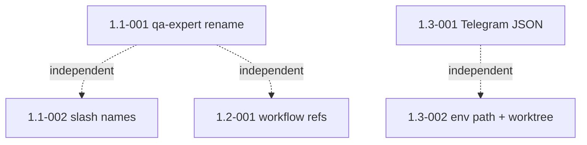

# Epic 1: Stabilize Foundation

> **Status: COMPLETE** — all 5 stories merged 2026-05-19 (PRs #14, #15, #16, #17, #18)

## Epic Overview

**Epic ID**: Epic-01
**Track**: MVP-blocking
**Description**: Fix the bugs and documentation drift surfaced by the multi-angle review (FX self-review plus Codex adversarial review). These are the corrections that move the framework from "demo works, production half-broken" to "ready to share with colleagues." Most items are single search-replace or single-script edits; together they remove the six highest-risk inconsistencies in the repo.
**Business Value**: Without these fixes, the first LTM colleague who runs `/build-stories` on a real project will hit a broken QA agent reference, a dead documentation link, or a leaking worktree. The framework cannot be shared until these are resolved. Each fix is small in isolation; the absence of any one of them blocks the MVP.
**Success Metrics**:
- Zero references to nonexistent agents, files, or skills resolve at runtime.
- Disk usage from `.claude/worktrees/` returns to under 50 MB after a full build.
- Telegram notifications render correctly with markdown-sensitive content (quotes, asterisks, backticks).
- `grep -F qa-expert` on the repo returns zero matches.

## Epic Scope

**Total Stories**: 5 | **Total Points**: 13 | **MVP Stories**: 5

## Features in This Epic

### Feature 1.1: Agent and Skill Reference Hygiene

#### Stories

##### Story 1.1-001: Reconcile `qa-expert` → `qa-engineer` across all skills
**User Story**: As FX, I want every skill that dispatches a QA sub-agent to reference the actual agent file in `agents/` so that the coverage and E2E gates execute the specialist agent I defined rather than silently falling back to `general-purpose`.
**Priority**: P0 (Critical)
**Points**: 2
**Stack hint**: bash, markdown
**Dependencies**: none
**Affected files**: `plugins/autonomous-sdlc/skills/build-stories/SKILL.md`, `plugins/autonomous-sdlc/skills/fix-issue/SKILL.md`, `plugins/autonomous-sdlc/skills/build-stories/e2e-gate.md`, `skills/design-e2e/SKILL.md`, `skills/execute-e2e-tests/SKILL.md`, `skills/fix-github-issue/SKILL.md`.

**Acceptance Criteria**:
- All occurrences of `qa-expert` in skill files are replaced with `qa-engineer`.
- `agents/qa-engineer.md` is the canonical agent file. No `agents/qa-expert.md` is created.
- `rg -F "qa-expert"` returns zero matches in tracked files.
- A manual `/build-stories --dry-run` run on a sample project resolves the QA agent without warnings.

**Definition of Done**:
- Search-replace committed under a single PR titled `fix: align qa-expert references to qa-engineer`.
- Change documented in `CHANGELOG.md` under "Fixed".
- CI agent-registry validator (Epic-02 Story 2.1-003) passes once that story ships.

##### Story 1.1-002: Reconcile slash-command naming in CLAUDE.md
**User Story**: As FX, I want the slash-command references in `CLAUDE.md` to match the bare-name form used in `README.md` and `WORKFLOW-v2.md` so that any agent reading `CLAUDE.md` does not try to invoke commands under namespaces that have been removed.
**Priority**: P0
**Points**: 1
**Stack hint**: markdown
**Dependencies**: none
**Affected files**: `CLAUDE.md`.

**Acceptance Criteria**:
- `/issues:create-issue` → `/create-issue` (or the namespaced form that actually exists, verified by listing `commands/` and `plugins/autonomous-sdlc/skills/`).
- `/quality:coverage` → `/coverage`.
- `/project:create-project-summary-stats` → `/create-project-summary-stats`.
- Every command referenced in `CLAUDE.md` resolves to an existing file.

**Definition of Done**:
- `CLAUDE.md` updated.
- Manual verification: each referenced command exists in `commands/**/*.md` or in a plugin's `SKILL.md`.
- Change noted in `CHANGELOG.md` under "Fixed".

### Feature 1.2: Documentation Repair

#### Stories

##### Story 1.2-001: Resolve `WORKFLOW.md` and `workflow-diagram.png` dangling references
**User Story**: As an LTM colleague reading the docs for the first time, I want every documented file link to resolve so that I do not chase broken pointers on my first install.
**Priority**: P0
**Points**: 2
**Stack hint**: markdown
**Dependencies**: none
**Affected files**: `CLAUDE.md`, `WORKFLOW-v2.md` (or its successor), possibly a renamed `WORKFLOW.md`, `workflow-diagrams/`.

**Acceptance Criteria**:
- Choose one path and execute it consistently:
  - Path A: rename `WORKFLOW-v2.md` to `WORKFLOW.md`, update `CLAUDE.md` references, retire the v2 suffix.
  - Path B: keep `WORKFLOW-v2.md` and update every `CLAUDE.md` reference to point at it.
- `WORKFLOW-v2.md` line 9 (`workflow-diagram.png`) either resolves (image added at that path) or is corrected to reference an existing file in `workflow-diagrams/`.
- Run `markdown-link-check` (or equivalent) against the repo and confirm zero broken links.

**Definition of Done**:
- All markdown links resolve.
- Link-check passes locally.
- Change noted in `CHANGELOG.md` under "Fixed".
- CI link-check (Epic-02 Story 2.1-001) passes once that story ships.

### Feature 1.3: Shell-Script Bugfixes

#### Stories

##### Story 1.3-001: Fix Telegram JSON escaping in `cmux-bridge.sh`
**User Story**: As FX, I want Telegram notifications to render correctly when titles or bodies contain quotes, backslashes, markdown characters, or newlines so that critical alerts (preflight failures, abort signals, E2E failures) do not silently drop or render broken.
**Priority**: P0
**Points**: 3
**Stack hint**: bash, jq
**Dependencies**: none
**Affected files**: `hooks/cmux-bridge.sh`.

**Acceptance Criteria**:
- `_send_telegram()` builds its JSON via `jq -n --arg chat "$TELEGRAM_CHAT_ID" --arg text "$TAGGED_TITLE\n$BODY" '{chat_id:$chat, text:$text}'`. No string interpolation of payload fields.
- The function tolerates titles and bodies containing: backticks, asterisks, underscores, double-quotes, backslashes, embedded newlines, `>`, and emoji.
- `parse_mode` is dropped (plain text) for MVP. Markdown-rendered notifications are a follow-up story under Epic-08 with proper escaping.
- The shell-level `> /dev/null 2>&1 || true` on the `curl` call is replaced with non-blocking error logging: failures append a single line to `~/.claude/logs/cmux-bridge.log` (created lazily) without blocking the caller.

**Definition of Done**:
- [x] Code committed.
- [x] A `bats` test in `tests/cmux-bridge.bats` verifies the function emits valid JSON when fed adversarial inputs from a fixture (`tests/fixtures/adversarial-strings.txt`).
- [x] Manual smoke test: send a notification with body `Test * _broken_ \backslash "quotes" and a 🚨 emoji` and confirm it arrives readable on Telegram.
- [x] Change noted in `CHANGELOG.md` under "Fixed".

##### Story 1.3-002: Fix `.env` source path and worktree leak
**User Story**: As FX, I want `cmux-bridge.sh` to find the actual `.env` file the installer writes, and I want completed worktrees to be torn down automatically, so that long parallel runs do not silently drop Telegram alerts and do not leave 150 MB of orphan checkouts on disk per run.
**Priority**: P0
**Points**: 5
**Stack hint**: bash
**Dependencies**: none
**Affected files**: `hooks/cmux-bridge.sh`, `hooks/cmux-stop.sh`, new `hooks/sweep-orphan-worktrees.sh`, `install.sh`, `docs/cmux-integration.md`.

**Acceptance Criteria**:
- `cmux-bridge.sh` sources `.env` from a path that matches where `install.sh` puts it. Either: (a) installer symlinks `$SCRIPT_DIR/.env` to `$HOME/.claude/.env` and the bridge sources `~/.claude/.env`, or (b) the bridge resolves `.env` relative to its own script directory (`$(dirname "${BASH_SOURCE[0]}")/../.env`).
- Verified by setting `TELEGRAM_BOT_TOKEN` only in `.env` (not exported in the shell) and confirming the bridge picks it up from a fresh shell with `bash -c '~/.claude/hooks/cmux-bridge.sh telegram Test Test'`.
- `hooks/cmux-stop.sh` removes any merged worktrees under `.claude/worktrees/agent-*` whose branch is fully merged into `main`.
- New script `hooks/sweep-orphan-worktrees.sh` removes any `.claude/worktrees/agent-*` older than 6 hours. Called from `cmux-stop.sh` at session end.
- After running `/build-stories` on a 5-story sample and waiting for cleanup, `du -sh .claude/worktrees/` returns under 50 MB.
- Sweeper is safe to run mid-build: it never removes a worktree whose branch is currently in use (checked via `git worktree list --porcelain`).

**Definition of Done**:
- Both scripts updated and committed.
- A bats test in `tests/sweep-orphan-worktrees.bats` covers: empty case, mid-build case (no removal), stale case (removal), permission-error case (graceful skip).
- Manual end-to-end test: run a parallel build, confirm worktrees tear down after merge, confirm orphans older than 6 hours are swept on session end.
- `docs/cmux-integration.md` updated to document the cleanup behavior.
- Change noted in `CHANGELOG.md` under "Fixed".

## Story Dependencies (within Epic-01)

All five stories are independent of each other. They can be built in any order or in parallel.

## Epic Acceptance

Epic-01 is complete when all 5 stories meet their Definition of Done and the following hold:

- `rg -F "qa-expert"` returns zero matches in tracked files.
- Every markdown link in `CLAUDE.md`, `README.md`, and `WORKFLOW*.md` resolves on disk.
- A test Telegram notification with adversarial content (quotes, asterisks, newlines, emoji) renders correctly.
- After a full parallel build, `du -sh .claude/worktrees/` is under 50 MB.
