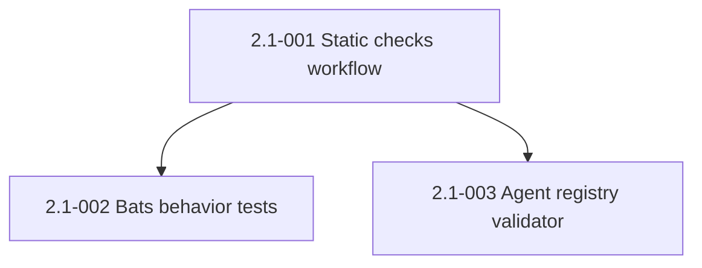

# Epic 2: Self-CI for the Framework

## Epic Overview

**Epic ID**: Epic-02
**Track**: MVP-blocking
**Description**: The framework preaches TDD and 90% coverage but has no tests of its own. This epic adds the minimum CI surface needed to prevent the drift items that Epic-01 just fixed from regressing, and to validate every PR before merge. Three GitHub Actions jobs: static checks (shellcheck, JSON schema, link-check), behavior tests (bats), and contract checks (agent registry, install dry-run).
**Business Value**: Of the ten drift items surfaced by the two reviews, at least seven would have been caught automatically by a 50-line CI workflow. CI is the cheapest insurance the framework can buy. It also signals to LTM colleagues that this is a maintained framework, not a personal experiment.
**Success Metrics**:
- Every PR runs all three CI jobs in under 90 seconds total.
- Adding a new skill that references a nonexistent agent fails CI on the PR.
- Adding a broken markdown link to any doc fails CI on the PR.
- The bats suite covers the four most-used `cmux-bridge.sh` subcommands.

## Epic Scope

**Total Stories**: 3 | **Total Points**: 8 | **MVP Stories**: 3

## Features in This Epic

### Feature 2.1: Static and Contract Checks in CI

#### Stories

##### Story 2.1-001: GitHub Actions workflow for static checks
**User Story**: As FX, I want every PR to be statically checked for shell-script errors, malformed JSON, and broken markdown links so that drift never reaches `main` again.
**Priority**: P0
**Points**: 3
**Stack hint**: GitHub Actions, shellcheck, jq, markdown-link-check
**Dependencies**: Epic-01 stories complete (otherwise CI fails on existing drift).
**Affected files**: new `.github/workflows/ci.yml`, possibly `.markdown-link-check.json` config.

**Acceptance Criteria**:
- New file `.github/workflows/ci.yml` runs on `pull_request` and `push` to `main`.
- Job `static-checks` includes three steps:
  - `shellcheck` on every `*.sh` file under `hooks/`, `install.sh`, `statusline-command.sh`. Severity floor: `warning`.
  - `jq -e .` on every `*.json` file in `.claude-plugin/`, `plugins/**/.claude-plugin/`, `mcp/`, `settings.json`. Schema validation against published Claude Code plugin schema if available.
  - `markdown-link-check` on every tracked `*.md` file with a config that allows `mailto:` and an allowlist for known transient hosts.
- Job completes in under 60 seconds on a standard runner.
- Status check `static-checks` is required for merging to `main` (branch protection rule documented in `docs/onboarding.md`).

**Definition of Done**:
- [x] Workflow committed.
- [x] Workflow passes on `main` after Epic-01 fixes are in.
- [ ] Branch protection rule documented in onboarding doc.
- [x] Change noted in `CHANGELOG.md` under "Added".

##### Story 2.1-002: Bats test suite for `cmux-bridge.sh` and `install.sh --dry-run`
**User Story**: As FX, I want behavior tests for the two scripts most likely to break for LTM colleagues so that I catch regressions before they hit a teammate's machine.
**Priority**: P0
**Points**: 3
**Stack hint**: bats-core, bash
**Dependencies**: Story 2.1-001 (workflow scaffold exists).
**Affected files**: new `tests/cmux-bridge.bats`, new `tests/install-dry-run.bats`, new `tests/fixtures/`, `.github/workflows/ci.yml`.

**Acceptance Criteria**:
- `tests/cmux-bridge.bats` covers:
  - `notify` subcommand with normal input renders a valid JSON when piped to `jq -e`.
  - `notify` with adversarial input (quotes, asterisks, newlines, emoji) renders valid JSON.
  - `telegram` with no `TELEGRAM_BOT_TOKEN` set exits 0 and writes a single log line to `~/.claude/logs/cmux-bridge.log`.
  - `log`, `status`, `progress`, `clear` subcommands all exit 0 when `cmux` is absent (graceful degradation).
- `tests/install-dry-run.bats` covers:
  - `./install.sh --dry-run --skip-tools --skip-mcp` exits 0 on macOS and on WSL2.
  - No actual symlinks created (verified by snapshotting `~/.claude/` before and after).
  - Dry-run output mentions every target file (verified by counting `[dry-run]` lines).
- New CI job `behavior-tests` runs both bats suites. Job completes in under 30 seconds.

**Definition of Done**:
- Both bats files committed.
- Fixtures committed under `tests/fixtures/`.
- CI job green on `main`.
- Change noted in `CHANGELOG.md` under "Added".

##### Story 2.1-003: Agent-registry validator
**User Story**: As FX, I want CI to fail on any PR that references a `subagent_type` for an agent file that does not exist so that the `qa-expert` class of bug cannot recur.
**Priority**: P0
**Points**: 2
**Stack hint**: bash or Python, GitHub Actions
**Dependencies**: Story 2.1-001 (workflow scaffold).
**Affected files**: new `scripts/validate-agent-registry.sh`, `.github/workflows/ci.yml`.

**Acceptance Criteria**:
- New script `scripts/validate-agent-registry.sh`:
  - Greps every `*.md` under `plugins/`, `skills/`, `commands/` for `subagent_type=` references.
  - Resolves each referenced agent name against `agents/` directory file basenames (without `.md` suffix).
  - Allowlist for built-in Claude Code subagent types: `general-purpose`, `Plan`, `Explore`, plus any documented in Claude Code's plugin schema.
  - Exits non-zero with a clear error message listing every unresolved reference and the file/line it appeared on.
- New CI job `contract-checks` runs the validator. Job completes in under 5 seconds.
- Running the validator locally on `main` after Epic-01 fixes returns zero errors.
- Documentation in `docs/onboarding.md` explains how to add a new agent (file under `agents/`) so it is discoverable to the validator.

**Definition of Done**:
- Script committed and executable.
- CI job green on `main` after Epic-01 fixes are in.
- Onboarding doc updated.
- Change noted in `CHANGELOG.md` under "Added".

## Story Dependencies (within Epic-02)

Story 2.1-001 lands first (workflow scaffold). Stories 2.1-002 and 2.1-003 add jobs to the existing workflow and can ship in either order.

## Out-of-Scope for Epic-02

- Coverage measurement on the bats suite (overkill for the size).
- Performance benchmarks for CI (handled informally by 90-second budget).
- Property-based tests on `cmux-bridge.sh` (deferred).
- CI on Windows runners directly (WSL2 inside GitHub Actions is a separate research item; for MVP we test on Ubuntu runners which match the WSL2 user environment closely enough).

## Epic Acceptance

Epic-02 is complete when all 3 stories meet their Definition of Done and the following hold:

- A test PR that introduces a broken link, a malformed JSON, a shell script syntax error, or a nonexistent subagent reference fails CI.
- CI runtime on `main` is under 90 seconds across all three jobs.
- Branch protection on `main` requires `static-checks`, `behavior-tests`, `contract-checks` to pass before merge.
