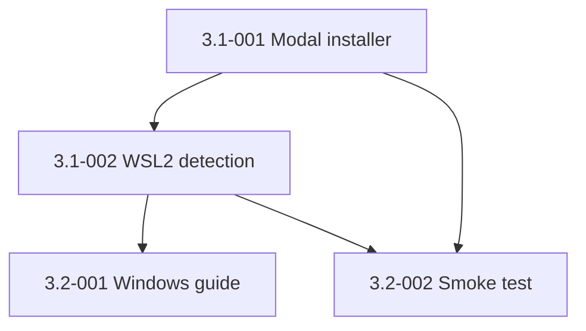

# Epic 3: Cross-Platform Installer (macOS + Windows/WSL2)

## Epic Overview

**Epic ID**: Epic-03
**Track**: MVP
**Description**: The current `install.sh` is a one-shot script that backs up files, symlinks the repo into `~/.claude/`, installs ten Homebrew packages, configures `yazi`, appends two shell functions to `~/.zshrc`, and merges MCP config. That is a lot to do to someone else's machine. This epic splits it into opt-in modes (`--core`, `--tools`, `--mcp`, `--shell`, `--all`), adds WSL2 detection for Windows colleagues, and documents what each mode does before it does it.
**Business Value**: An LTM colleague who runs the installer should see exactly what will be touched, choose what they want, and trust that opting out of a section actually skips it. The current "skip-mcp / skip-tools" inversion (default-on, opt-out) is the wrong default for a public tool: defaults should be conservative and additive. This epic flips that polarity.
**Success Metrics**:
- A clean macOS 13 box runs `./install.sh --core` and ends up with a working framework in under 60 seconds.
- A clean WSL2 (Ubuntu 22.04) box runs `./install.sh --core` and ends up with a working framework in under 60 seconds.
- `./install.sh --all --dry-run` accurately previews every file touched, every package installed, every shell function appended. Zero discrepancies between dry-run output and actual run output.
- The README has a section "What this script does to your machine" that lists every side effect, sorted by mode.

## Epic Scope

**Total Stories**: 4 | **Total Points**: 13 | **MVP Stories**: 4

## Features in This Epic

### Feature 3.1: Modal Installer

#### Stories

##### Story 3.1-001: Split `install.sh` into modes
**User Story**: As an LTM colleague, I want to install only the parts of the framework I need (core symlinks vs CLI tools vs MCP servers vs shell functions) so that the installer never touches anything I did not opt into.
**Priority**: P0
**Points**: 5
**Stack hint**: bash
**Dependencies**: Epic-02 Story 2.1-002 (bats tests must cover dry-run behavior).
**Affected files**: `install.sh`, possibly split into `install/core.sh`, `install/tools.sh`, `install/mcp.sh`, `install/shell.sh` with `install.sh` as the dispatcher.

**Acceptance Criteria**:
- `install.sh` accepts new flags: `--core` (default if no mode flag), `--tools`, `--mcp`, `--shell`, `--all`. Combinations are valid: `./install.sh --core --mcp`.
- Backward-compatible: `--skip-mcp` and `--skip-tools` still work but emit a deprecation warning pointing at the new modes. Removed in next MAJOR.
- Each mode is idempotent: re-running it produces no new changes if everything is already in place.
- `--dry-run` exactly previews every action across all selected modes. The mismatch surfaced by Codex (dry-run printing "Created ~/.claude" when no directory was actually created) is fixed.
- The README has a table mapping each mode to what it touches:

| Mode | Touches | Files added | Files modified |
|------|---------|-------------|----------------|
| `--core` | `~/.claude/` | symlinks for `CLAUDE.md`, `agents/`, `commands/`, `skills/`, `hooks/`, `settings.json`, `statusline-command.sh`, `keybindings.json`, `reference-docs/`, `docs/`, `plugins/marketplaces/fx-claude-config` | none |
| `--tools` | `/opt/homebrew/` (macOS) or `/usr/local/` (WSL2 via apt or brew) | `yazi`, `bat`, `fd`, `rg`, `fzf`, `zoxide`, `ffmpeg`, `imagemagick`, `poppler`, `sevenzip`, `jq`, optional Nerd Font | `~/.config/yazi/yazi.toml`, `~/.config/yazi/init.lua` (created if absent) |
| `--mcp` | `~/.claude.json` | merges `mcp/config.template.json` into existing JSON via `jq` | only the `mcpServers` key |
| `--shell` | `~/.zshrc` | nothing | appends `dev()` and `y()` shell functions if absent |

**Definition of Done**:
- [x] All four modes work independently and in combination.
- [x] Dry-run output matches actual run output exactly (verified by Epic-02 bats test).
- [x] README "What this script does" table is committed.
- [x] Change noted in `CHANGELOG.md` under "Changed" with backward-compat note.
- [x] All DoD criteria satisfied (merged via PR #26)

##### Story 3.1-002: WSL2 detection and platform-aware behavior
**User Story**: As an LTM colleague on Windows, I want the installer to detect WSL2 and behave correctly without me having to pass a `--platform` flag.
**Priority**: P0
**Points**: 3
**Stack hint**: bash
**Dependencies**: Story 3.1-001.
**Affected files**: `install.sh` (or split files), `mcp/config.template.json` (paths may need adjustment for WSL2).

**Acceptance Criteria**:
- Installer detects WSL2 via `grep -qi microsoft /proc/version` and sets `PLATFORM=WSL2` (in addition to existing `Darwin`, `Linux`).
- On WSL2, the `--tools` mode prefers `apt` for system packages (`fd-find`, `ripgrep`, `bat`, `jq`, `fzf`) and only uses `brew` if it is present and the user explicitly passes `--prefer-brew`. Falls back gracefully when `apt` cannot install a package (e.g., `yazi` is not in apt; show a one-line install hint via `cargo install --locked yazi-fm`).
- On WSL2, the `--mcp` mode validates that `BROWSER_PATH` points at a path reachable from WSL2 (i.e., starts with `/mnt/c/` for a Windows-side browser, or is a WSL-side path). Emits a clear warning if neither.
- On WSL2, the `--shell` mode appends to `~/.bashrc` if zsh is not the default shell. The `dev()` function is skipped on WSL2 because cmux does not run there (replaced by a stub that prints "cmux is macOS-only; this command is a no-op on WSL2").

**Definition of Done**:
- WSL2 detection lands.
- A fresh WSL2 Ubuntu 22.04 box runs `./install.sh --core --tools --mcp` successfully end-to-end.
- README has a "Windows install via WSL2" section.
- Change noted in `CHANGELOG.md` under "Added".

### Feature 3.2: Verification and Documentation

#### Stories

##### Story 3.2-001: Windows-via-WSL2 install guide
**User Story**: As an LTM colleague on Windows, I want a step-by-step guide that takes me from "fresh Windows 11" to "framework installed" without ambiguity so that I do not need to ping FX for help.
**Priority**: P0
**Points**: 2
**Stack hint**: markdown
**Dependencies**: Story 3.1-002 (WSL2 detection lands first).
**Affected files**: new `docs/install-windows.md`, `README.md` updated to link it.

**Acceptance Criteria**:
- New file `docs/install-windows.md` covers:
  - WSL2 install command (`wsl --install -d Ubuntu-22.04`).
  - First-boot Ubuntu setup (user, password).
  - Git, gh CLI, GitHub auth.
  - Clone the repo inside WSL2 (not on the Windows side).
  - Run `./install.sh --core`.
  - Optional: `./install.sh --tools`, `./install.sh --mcp`, `./install.sh --shell`.
  - How to access the repo from VSCode on Windows (Remote-WSL extension).
  - Known limitations: cmux is macOS-only, so cmux sidebar features are unavailable; Telegram still works.
- README links the guide from the "Install" section.
- The guide is dated and includes a "tested with" footer naming the WSL2 and Ubuntu versions used.

**Definition of Done**:
- Doc committed.
- README link added.
- Reviewed by one LTM colleague before MVP pilot.

##### Story 3.2-002: Clean-machine install verification (macOS and WSL2)
**User Story**: As FX, I want a documented, reproducible smoke test for both supported platforms so that I never ship a release that breaks on a fresh box.
**Priority**: P0
**Points**: 3
**Stack hint**: bash, manual test plan
**Dependencies**: Stories 3.1-001 and 3.1-002.
**Affected files**: new `docs/smoke-test.md`, new `scripts/smoke-test.sh`.

**Acceptance Criteria**:
- New script `scripts/smoke-test.sh` runs in CI on macOS-latest and ubuntu-latest GitHub Actions runners. It:
  - Creates a temporary `$HOME` (mktemp).
  - Runs `./install.sh --core --dry-run`, asserts non-zero output, asserts exit 0.
  - Runs `./install.sh --core`, asserts symlinks created, asserts exit 0.
  - Runs `./install.sh --core` a second time, asserts idempotent (no new changes, no errors).
  - Runs `./install.sh --uninstall`, asserts symlinks removed.
- New doc `docs/smoke-test.md` documents the manual smoke test for the parts CI cannot cover (`--tools` mode on a Mac with brew, `--mcp` mode with an actual `BROWSER_PATH`, full end-to-end `/build-stories` on a sample project).
- The macOS and WSL2 manual smoke tests are run before every release tag (Epic-05).

**Definition of Done**:
- Script committed and integrated into CI (Epic-02).
- Doc committed.
- One macOS and one WSL2 manual run completed and dated.
- Change noted in `CHANGELOG.md` under "Added".

## Story Dependencies (within Epic-03)

## Out-of-Scope for Epic-03

- Native PowerShell installer (deferred to roadmap if WSL2 proves insufficient).
- Linux desktop distro support (Ubuntu via WSL2 is enough for MVP).
- ARM Linux server support.
- Docker-based install ("run the framework in a container").
- An uninstall mode that also removes installed brew packages (deliberately not done; users own their brew env).

## Epic Acceptance

Epic-03 is complete when all 4 stories meet their Definition of Done and the following hold:

- A fresh macOS 13 box runs `./install.sh --core` to working state in under 60 seconds.
- A fresh WSL2 Ubuntu 22.04 box runs `./install.sh --core` to working state in under 60 seconds.
- The README "What this script does to your machine" section is in place.
- One LTM colleague has reviewed the Windows guide and confirmed it works on their setup.
