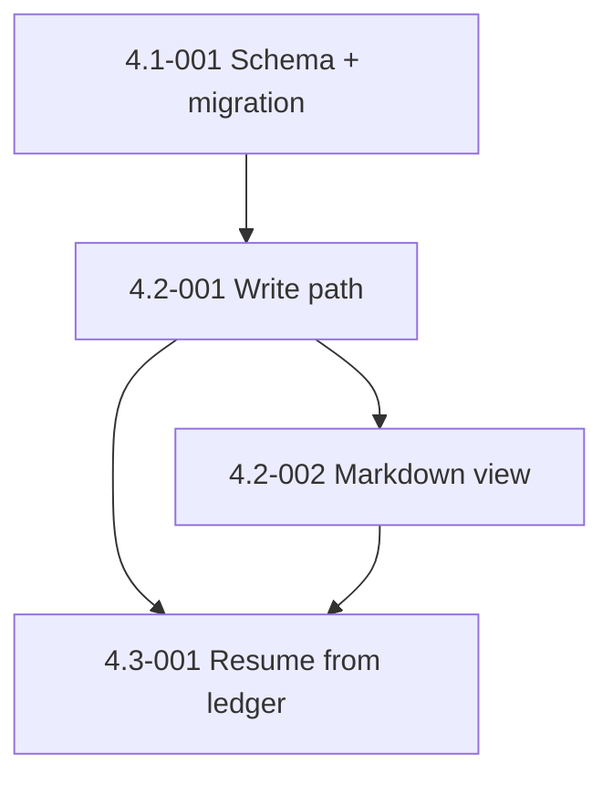

# Epic 4: Durable State with SQLite

## Epic Overview

**Epic ID**: Epic-04
**Track**: MVP
**Description**: Today, the truth source for a `build-stories` run is `docs/stories/.build-progress.md`. Markdown cannot reliably carry typed state across a crash: story ID, branch name, PR number, commit SHA, stage, attempt count, failure category, coverage result, merge status, timestamps, cleanup state. After a failed long run, you cannot resume cleanly because half of that data is implicit in human-readable prose. This epic introduces SQLite as the durable ledger, keeps markdown as the human-readable view, and adds a recovery flow that picks up at the failed stage.
**Business Value**: A 20-story overnight batch that fails at story 17 is currently unrecoverable without manual editing of markdown. With a typed ledger, the same failure becomes "resume from run-id, skip completed stages, retry failed stage." That is the difference between "this framework is fun" and "this framework is reliable." The Codex review identified this as the single deepest gap in the architecture.
**Success Metrics**:
- A `build-stories` run that is killed mid-stage resumes within 30 seconds and picks up at the failed story's failed stage.
- The SQLite ledger is queryable: `sqlite3 .sdlc-state.db "SELECT story_id, stage, status FROM stages WHERE run_id=?"` returns the expected rows.
- Markdown view (`.build-progress.md`) is regenerated from SQLite on every state transition. Editing the markdown by hand has zero effect on resume behavior; SQLite wins.
- Zero data loss across 10 consecutive runs (verified by Epic-06 pilot).

## Epic Scope

**Total Stories**: 4 | **Total Points**: 18 | **MVP Stories**: 4

## Features in This Epic

### Feature 4.1: Schema and Migration

#### Stories

##### Story 4.1-001: Define ledger schema and migration tooling
**User Story**: As FX, I want a SQLite schema that captures every dimension of a `build-stories` run (story, stage, attempt, failure category, timestamps) and a migration pattern that lets the schema evolve without breaking existing databases.
**Priority**: P1
**Points**: 5
**Stack hint**: SQLite, bash, possibly Python
**Dependencies**: none (independent of other epics).
**Affected files**: new `state/schema.sql`, new `state/migrations/`, new `scripts/sdlc-state.sh`, `.gitignore` (exclude `.sdlc-state.db`).

**Acceptance Criteria**:
- Schema defined in `state/schema.sql` with these tables (minimum):
  - `runs(id TEXT PRIMARY KEY, scope TEXT, started_at TIMESTAMP, finished_at TIMESTAMP, mode TEXT, total_stories INTEGER, completed INTEGER, failed INTEGER, status TEXT)`
  - `stories(run_id TEXT, story_id TEXT, epic_id TEXT, title TEXT, priority TEXT, points INTEGER, agent_type TEXT, branch TEXT, pr_number INTEGER, current_stage TEXT, status TEXT, PRIMARY KEY (run_id, story_id))`
  - `stages(run_id TEXT, story_id TEXT, stage_name TEXT, attempt INTEGER, status TEXT, started_at TIMESTAMP, finished_at TIMESTAMP, failure_category TEXT, output_path TEXT, PRIMARY KEY (run_id, story_id, stage_name, attempt))`
  - `events(id INTEGER PRIMARY KEY AUTOINCREMENT, run_id TEXT, story_id TEXT, ts TIMESTAMP, level TEXT, source TEXT, message TEXT)`
- New script `scripts/sdlc-state.sh` provides subcommands: `init` (run schema), `migrate` (apply pending migrations from `state/migrations/`), `show <run-id>`, `prune --older-than <duration>`.
- Migration tooling: each migration is `state/migrations/NNN-<name>.sql`. `sdlc-state migrate` applies migrations in order, tracking applied versions in a `_migrations` table.
- `.sdlc-state.db` is in `.gitignore`.
- WAL mode enabled (`PRAGMA journal_mode=WAL`) for concurrent reads during writes.

**Definition of Done**:
- [x] Schema and migration tooling committed (PR #25).
- [x] A bats test in `tests/sdlc-state.bats` covers: init on empty DB, migrate apply, idempotent re-run, schema introspection (22 tests: 11 success-path in sdlc-state.bats, 11 error-path in sdlc-state-errors.bats).
- [x] Change noted in `CHANGELOG.md` under "Added" (v1.6.0).

### Feature 4.2: Write Path

#### Stories

##### Story 4.2-001: Orchestrator and agents write to the ledger
**User Story**: As FX, I want `build-stories` (the orchestrator) and every dispatched agent to record stage transitions in SQLite so that the database is the truth source, not the markdown file.
**Priority**: P1
**Points**: 5
**Stack hint**: bash, SQLite
**Dependencies**: Story 4.1-001.
**Affected files**: `plugins/autonomous-sdlc/skills/build-stories/SKILL.md`, all `*-agent-prompt.md` under that skill, `plugins/autonomous-sdlc/skills/fix-issue/SKILL.md`.

**Acceptance Criteria**:
- `build-stories/SKILL.md` writes to SQLite on every phase transition:
  - At Phase 1 (Preflight): `INSERT INTO runs ...` and capture the run ID (UUID).
  - At Phase 4b (Cohort scheduling): one `INSERT INTO stories ...` per story.
  - At each stage start: `INSERT INTO stages ...` with status `IN_PROGRESS`.
  - At each stage end: `UPDATE stages SET status, finished_at, failure_category, output_path WHERE ...`.
  - At each `cmux-bridge log` call: `INSERT INTO events ...` (mirroring the sidebar entry).
- Agent prompts include the run ID and story ID and emit ledger updates via a shared helper: `~/.claude/hooks/sdlc-state-emit.sh stage-update <run> <story> <stage> <status>`.
- Concurrent agent writes do not deadlock: WAL mode plus a single-writer pattern via the helper script (no agent runs raw SQL).
- A single environment variable `SDLC_RUN_ID` is exported by the orchestrator and inherited by all sub-agents.

**Definition of Done**:
- [x] Skill updated with ledger emit calls.
- [x] Helper script `~/.claude/hooks/sdlc-state-emit.sh` committed.
- [x] Bats test verifies a simulated 3-story 4-stage run produces the expected row counts.
- [x] Change noted in `CHANGELOG.md` under "Added".

##### Story 4.2-002: Markdown view generator
**User Story**: As FX, I want `.build-progress.md` to stay human-readable but no longer be the truth source so that I can still glance at progress in a text editor without breaking resume behavior.
**Priority**: P1
**Points**: 3
**Stack hint**: bash, SQLite, markdown
**Dependencies**: Story 4.2-001.
**Affected files**: new `scripts/render-progress-md.sh`, `build-stories` skill calls it after every state transition.

**Acceptance Criteria**:
- New script `scripts/render-progress-md.sh <run-id>` queries SQLite and writes `docs/stories/.build-progress.md` with the existing markdown shape (table of stories with status, PR, branch, points, timestamps).
- Called from `build-stories` after every stage transition.
- The markdown contains a prominent header: `<!-- AUTOGENERATED FROM SQLite. EDITS WILL BE OVERWRITTEN. Run \`sdlc-state show <run-id>\` to query directly. -->`.
- A bats test verifies: render → edit markdown → re-render → markdown matches SQLite, edits lost.

**Definition of Done**:
- Renderer committed.
- Skill calls it.
- Bats test passes.
- Change noted in `CHANGELOG.md` under "Changed".

### Feature 4.3: Recovery

#### Stories

##### Story 4.3-001: Resume run from ledger state
**User Story**: As FX, I want a killed or crashed `build-stories` run to resume cleanly from SQLite so that I do not lose hours of overnight work to a flaky test.
**Priority**: P1
**Points**: 5
**Stack hint**: bash, SQLite
**Dependencies**: Stories 4.2-001 and 4.2-002.
**Affected files**: `plugins/autonomous-sdlc/skills/build-stories/SKILL.md`, new `scripts/sdlc-state.sh resume <run-id>` subcommand.

**Acceptance Criteria**:
- `/build-stories resume` (existing scope flag) is enhanced: if `SDLC_RUN_ID` is set, it resumes that specific run; otherwise it picks the most recent run with `status = IN_PROGRESS`.
- Resume logic:
  - Read all stories for the run from SQLite.
  - Skip stories whose `status = DONE`.
  - Skip completed stages for stories whose `status = IN_PROGRESS`.
  - For the currently-failed stage: increment `attempt`, mark previous stage row as `STALE` (not `FAILED`), and dispatch the agent.
  - Surface to the user (cmux pill, Telegram) which stories are being resumed and at what stage.
- Worktree cleanup on resume: if a worktree exists for a story marked `IN_PROGRESS` and `attempt > 1`, prompt the user (or auto-clean with `--auto`) before reusing or re-creating it.
- A bats test simulates a kill at Stage 2 of a 3-story run, verifies that resume picks up exactly at Stage 2 of the killed story.

**Definition of Done**:
- Resume logic committed.
- Bats test passes.
- Manual test: kill a real run mid-Stage-2, resume, confirm correct pickup.
- Documentation in `docs/cmux-integration.md` and the skill's preamble.
- Change noted in `CHANGELOG.md` under "Added".

## Story Dependencies (within Epic-04)

## Out-of-Scope for Epic-04

- A web UI for the ledger (deferred to roadmap Epic-07).
- Encryption at rest (deferred until Epic-08 security review).
- Replication or backup of the ledger (single-machine MVP).
- Cross-run analytics beyond the per-run summary (the summary-agent already covers what we need).
- Postgres or other backends (SQLite is the right shape for single-user single-machine).

## Epic Acceptance

Epic-04 is complete when all 4 stories meet their Definition of Done and the following hold:

- A simulated kill at Stage 2 of a 3-story run resumes cleanly to completion.
- The markdown view header explicitly states autogeneration.
- The CLI `sdlc-state show <run-id>` returns the expected typed data.
- Manual edits to `.build-progress.md` have zero effect on resume behavior.
