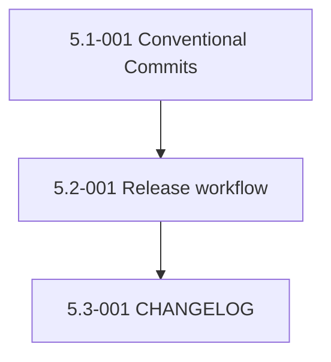

# Epic 5: Automatic Release Management

> **Status: COMPLETE** — all 3 stories merged 2026-05-19 (PRs #22, #23, #24)

## Epic Overview

**Epic ID**: Epic-05
**Track**: MVP
**Description**: Today the repo has no release discipline. `plugin.json` and `marketplace.json` both say `version: "0.1.0"` and have for months. There is no CHANGELOG. Users have no way to know "what changed between yesterday and today." This epic introduces Conventional Commits as the commit format, commitlint as a PR check, a GitHub Actions release workflow that bumps semver and creates a tag plus a GitHub Release on every push to `main`, and a CHANGELOG that is auto-maintained from commit metadata.
**Business Value**: LTM colleagues need to know when there is a new version, what changed, and whether the change is safe for them. Without a release pipeline they have to ask FX every time they pull. With this epic, every commit to `main` produces a tag `vX.Y.Z`, a release with auto-generated notes, and a CHANGELOG entry. Colleagues can pin to a tag, watch the Releases page, or pull `main` knowing the version delta is documented.
**Success Metrics**:
- Every commit to `main` produces a new tag `vX.Y.Z` within 90 seconds.
- Tag bump matches commit type: `feat` → MINOR, `fix` → PATCH, `BREAKING CHANGE` → MAJOR.
- GitHub Release notes auto-generated from the commit log between tags.
- CHANGELOG.md updated on every release.
- `plugin.json` and `marketplace.json` versions match the latest tag.

## Epic Scope

**Total Stories**: 3 | **Total Points**: 8 | **MVP Stories**: 3

## Features in This Epic

### Feature 5.1: Commit Format Enforcement

#### Stories

##### Story 5.1-001: Conventional Commits + commitlint on PRs
**User Story**: As FX, I want every PR to enforce the Conventional Commits format so that the release workflow has reliable signal for semver bumps and changelog generation.
**Priority**: P1
**Points**: 2
**Stack hint**: GitHub Actions, commitlint
**Dependencies**: Epic-02 Story 2.1-001 (CI workflow scaffold).
**Affected files**: new `.commitlintrc.json`, `.github/workflows/ci.yml` (add commitlint job), `docs/onboarding.md` (document commit format), `CLAUDE.md` (mention commit format in source-control reference).

**Acceptance Criteria**:
- `.commitlintrc.json` configures conventional-commits rules: allowed types are `feat`, `fix`, `chore`, `docs`, `refactor`, `test`, `ci`, `perf`, `build`, `revert`.
- Scope is optional but recommended; lowercase enforced.
- Subject case: lower-case start, no trailing period, max 72 chars.
- Body and footer: blank-line separated, `BREAKING CHANGE:` token recognized.
- New CI job `commit-format` runs `commitlint --from origin/main --to HEAD` on every PR. Fails the PR if any commit in the range violates the rules.
- Existing commits on `main` are exempt (workflow only checks PR commits).
- Onboarding doc has a "How to write a commit message" section with three concrete examples.

**Definition of Done**:
- [x] Config committed.
- [x] CI job green.
- [ ] Onboarding doc updated.
- [x] Change noted in `CHANGELOG.md` under "Added".

### Feature 5.2: Release Workflow

#### Stories

##### Story 5.2-001: GitHub Actions release workflow
**User Story**: As FX, I want every push to `main` to automatically determine the semver bump, create a tag `vX.Y.Z`, create a GitHub Release with auto-generated notes, and update `plugin.json` and `marketplace.json` versions so that the framework has clean release discipline with zero manual ceremony.
**Priority**: P1
**Points**: 5
**Stack hint**: GitHub Actions, semver, jq
**Dependencies**: Story 5.1-001.
**Affected files**: new `.github/workflows/release.yml`, `plugin.json` and `marketplace.json` (read and updated by the workflow), `CHANGELOG.md` (created/appended).

**Acceptance Criteria**:
- New workflow `.github/workflows/release.yml` triggers on `push: branches: [main]`.
- Workflow steps:
  1. Checkout with full history (`fetch-depth: 0`).
  2. Determine the last tag (`git describe --tags --abbrev=0` or `v0.0.0` if none).
  3. Parse Conventional Commit types between last tag and HEAD. Bump rules:
     - Any `BREAKING CHANGE:` footer or `!` after type → MAJOR.
     - Any `feat:` → MINOR (if no MAJOR).
     - Any `fix:`, `perf:`, `refactor:` → PATCH (if no MAJOR/MINOR).
     - Only `chore:`, `docs:`, `test:`, `ci:`, `build:` → no release (workflow exits 0 with a "no release" log line).
  4. Compute new version, e.g. `v0.4.0` → `v0.4.1` for a PATCH.
  5. Update `plugins/autonomous-sdlc/.claude-plugin/plugin.json` and `.claude-plugin/marketplace.json` `version` fields to the new value (without the `v` prefix per JSON convention).
  6. Update `CHANGELOG.md`: prepend a new section for the new version with grouped entries from the commit log.
  7. Commit the version + changelog update with message `chore(release): vX.Y.Z`. Use a deploy key or workflow PAT so the bot commit can push.
  8. Create a git tag `vX.Y.Z` pointing at the release commit.
  9. Create a GitHub Release via `gh release create vX.Y.Z --generate-notes --notes-file CHANGELOG-SECTION.md`.
- Workflow can be skipped by including `[skip release]` in the commit message (e.g., for docs-only emergency fixes).
- Workflow does not run on tags it created (loop prevention via `paths-ignore` or commit message filter).
- `concurrency` group prevents parallel releases racing.

**Definition of Done**:
- [x] Workflow committed.
- [x] A test commit on a feature branch followed by merge to `main` produces a new tag and release.
- [x] `plugin.json` and `marketplace.json` versions match the new tag.
- [x] CHANGELOG entry created.
- [x] Change noted in `CHANGELOG.md` under "Added".

### Feature 5.3: CHANGELOG Maintenance

#### Stories

##### Story 5.3-001: CHANGELOG.md bootstrap and auto-maintenance
**User Story**: As an LTM colleague, I want a clear human-readable record of every framework release so that I can decide when and what to pull.
**Priority**: P1
**Points**: 1
**Stack hint**: markdown
**Dependencies**: Story 5.2-001.
**Affected files**: new `CHANGELOG.md`, `.github/workflows/release.yml` references it.

**Acceptance Criteria**:
- New `CHANGELOG.md` follows Keep a Changelog format with sections: Added, Changed, Deprecated, Removed, Fixed, Security.
- Initial entry covers the repo state at the time of the first auto-release tag (which is determined by Epic-05 Story 5.2-001). All work in Epic-01 through Epic-04 lands as entries.
- Format example:

```markdown
# Changelog

All notable changes to this project will be documented in this file.

The format is based on [Keep a Changelog](https://keepachangelog.com/en/1.1.0/),
and this project adheres to [Semantic Versioning](https://semver.org/spec/v2.0.0.html).

## [Unreleased]

## [v0.2.0] - 2025-XX-XX

### Added
- GitHub Actions release workflow with auto-semver + auto-tag (#XX)
- ...

### Fixed
- qa-expert → qa-engineer references across SDLC skills (#XX)
- ...
```

- Release workflow appends entries automatically based on commit types. The "Unreleased" section is consumed and emptied on every release.
- A pre-commit hook (or PR check) verifies CHANGELOG syntax is valid Keep-a-Changelog (deferred: skip for MVP, document as roadmap).

**Definition of Done**:
- [x] CHANGELOG.md bootstrapped.
- [x] Release workflow updates it automatically.
- [x] First release produced cleanly.
- [ ] Documented in `docs/onboarding.md`.

## Story Dependencies (within Epic-05)



## Design Notes

**Why not release-please?** Google's `release-please` is the conservative default and opens a "release PR" that the maintainer merges to trigger a release. Cleaner audit trail but slower cadence. FX explicitly wants "when we commit it should automatically bump and tag." Direct-tag-on-push matches that intent. If cadence becomes a problem (too many micro-releases), switching to `release-please` is a swap-in for the release workflow without breaking the Conventional Commits foundation.

**Why bump on `chore:` exclusion?** The semver spec does not call docs or chore changes a release. The workflow exits cleanly with a "no release" log so users do not see noise from `chore: bump deps` commits.

**Version sync between manifests.** `plugin.json` and `marketplace.json` carry the same `version` because they describe the same release artifact. The workflow updates both via `jq` in a single commit. CI (Epic-02) enforces they match the latest tag.

**Tag format.** Git tags use the `v` prefix: `v0.4.1`. JSON `version` fields drop the prefix: `"0.4.1"`. This matches conventional ecosystem behavior (npm, Cargo, semver spec).

**Skip-release escape hatch.** `[skip release]` in a commit message bypasses the workflow. Useful for emergency doc fixes or workflow tweaks that should not bump version.

**Deploy permissions.** Workflow needs `contents: write` and `pull-requests: write`. The bot commit (`chore(release): vX.Y.Z`) is authored by `github-actions[bot]` with `GITHUB_TOKEN`; no PAT needed unless branch protection requires a real user signature.

## Out-of-Scope for Epic-05

- Pre-release tags (`-rc.1`, `-beta.2`). Defer until a release blows up and we need a staging lane.
- Signed tags. Defer until external contributors arrive (post-MVP).
- Mirroring releases to the Codex plugin in `nix-install`. Handled by Epic-07 sync mechanism.
- A release calendar or cadence enforcement. The framework releases when commits land.

## Epic Acceptance

Epic-05 is complete when all 3 stories meet their Definition of Done and the following hold:

- A test commit on a feature branch, merged to `main` with a `feat:` prefix, produces a new MINOR tag within 90 seconds.
- A test commit with only `docs:` produces no release.
- A test commit with `feat!:` (or `BREAKING CHANGE:` footer) produces a new MAJOR tag.
- `plugin.json`, `marketplace.json`, and the git tag all match.
- A GitHub Release with auto-generated notes exists at `https://github.com/fxmartin/claude-code-config/releases/tag/vX.Y.Z`.
- CHANGELOG.md has the expected entry.
