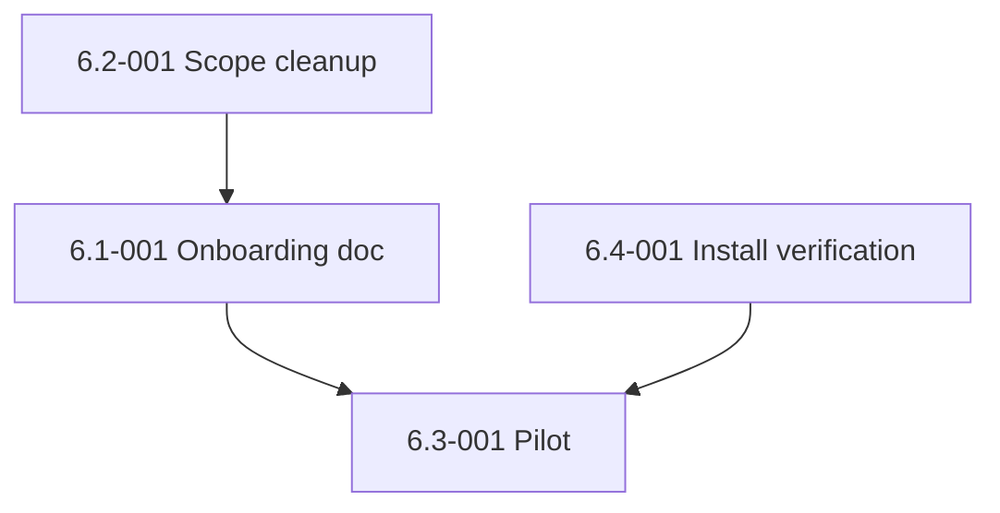

# Epic 6: Public Release Readiness

## Epic Overview

**Epic ID**: Epic-06
**Track**: MVP
**Description**: The final epic that gates MVP. Once Epic-01 through Epic-05 are merged, the framework is technically ready. This epic adds the polish, the onboarding doc, the scope cleanup (personal helpers separated from the SDLC plugin), and runs the actual five-colleague pilot that proves the MVP claim. If this epic fails, MVP is not shipped.
**Business Value**: Without this epic, FX has a working framework that LTM colleagues cannot adopt. With this epic, the five colleagues can install and use the framework on their own. This is the difference between "I built a thing" and "I shipped a thing."
**Success Metrics**:
- Five LTM colleagues install the framework in under 15 minutes each, without contacting FX.
- All five complete a sample `/brainstorm → /generate-epics → /build-stories` run on a fresh repo end-to-end.
- Pilot feedback yields ≤ 3 blocking issues; all are filed as GitHub issues, prioritized, and either fixed or deferred to roadmap with explanation.
- The repo's `agents/` directory contains only SDLC-relevant agents in the plugin scope; personal helpers (crypto, profile research, executive summary) are clearly separated.

## Epic Scope

**Total Stories**: 4 | **Total Points**: 9 *(was 11; 2 points moved to Epic-09 with the live pilot)* | **MVP Stories**: 4

## Features in This Epic

### Feature 6.1: Onboarding and Documentation Polish

#### Stories

##### Story 6.1-001: Onboarding doc for LTM colleagues
**User Story**: As an LTM colleague new to the framework, I want a single document that walks me from "I have a Mac or WSL2 box" to "I just merged my first auto-built PR" in under 30 minutes of reading so that I do not need to ping FX or read the entire codebase.
**Priority**: P1
**Points**: 3
**Stack hint**: markdown
**Dependencies**: Epic-03 (cross-platform installer), Epic-05 (release workflow live).
**Affected files**: new `docs/onboarding.md`, `README.md` links it from the top.

**Acceptance Criteria**:
- New file `docs/onboarding.md` covers, in order:
  - "Before you start": what the framework is, what it touches, the auto-permission default (and how to opt out), the hardware envelope.
  - "Install on macOS" (10 min).
  - "Install on Windows via WSL2" (link to `docs/install-windows.md`).
  - "First run": `/brainstorm` on a new repo, walking through the 8-question flow.
  - "Build your first stories": `/generate-epics` then `/build-stories --dry-run`, then `/build-stories epic-01 --sequential` (sequential for the first real run, to keep the cognitive load low).
  - "What just happened": expected output, where state lives, how to check the SQLite ledger.
  - "When things go wrong": the three most likely failure modes (preflight test red, agent dispatch fail, merge conflict) and how to resolve each.
  - "Commit format": one paragraph on Conventional Commits.
  - "Where to file issues": link to GitHub issue templates.
  - "Glossary": cohort, worktree, gate, skill, agent, MCP.
- README links the doc from the top of the file: "Start here: [docs/onboarding.md](docs/onboarding.md)".
- One LTM colleague reviews the doc before the pilot and confirms it answers their questions.

**Definition of Done**:
- [x] Doc committed.
- [x] README link added.
- [ ] One colleague review captured (pending pilot).
- [x] Change noted in `CHANGELOG.md` under "Added".
- [x] Doc + README link + CHANGELOG entry committed (merged via PR #35).

### Feature 6.2: Scope Cleanup

#### Stories

##### Story 6.2-001: Separate personal agents from the SDLC plugin
**User Story**: As an LTM colleague installing the `autonomous-sdlc` plugin, I want only SDLC-relevant agents to come with the plugin so that I am not surprised to find crypto analysts and profile researchers in my agent roster.
**Priority**: P1
**Points**: 3
**Stack hint**: bash, markdown, plugin manifest
**Dependencies**: Epic-01 (qa-engineer rename) so the registry is clean first.
**Affected files**: `agents/` directory restructure, `plugins/autonomous-sdlc/.claude-plugin/plugin.json` (agent list if applicable), `README.md`, `docs/onboarding.md`.

**Acceptance Criteria**:
- Move the following agents to `agents/personal/` (still tracked, still installed by `--core` mode, but not surfaced under the plugin scope):
  - `crypto-coin-analyzer.md`
  - `crypto-market-agent.md`
  - `executive-summary-generator.md`
  - `professional-profile-researcher.md`
- Keep these as plugin-scope agents in `agents/`:
  - `backend-typescript-architect.md`
  - `python-backend-engineer.md`
  - `ui-engineer.md`
  - `bash-zsh-macos-engineer.md`
  - `podman-container-architect.md`
  - `qa-engineer.md`
  - `senior-code-reviewer.md`
  - `meta-agent.md`
- README "Agent roster" section is split into two tables: "SDLC plugin agents" and "Personal extras."
- The agent-registry validator (Epic-02 Story 2.1-003) understands the `personal/` subdirectory and validates references in either location.
- Onboarding doc mentions the personal extras in a single line: "the install also ships personal helper agents (crypto, profile research, executive summary); they do not appear in the SDLC workflow and can be ignored."

**Definition of Done**:
- [x] Files moved.
- [x] Registry validator updated.
- [x] README split.
- [x] Onboarding doc updated.
- [x] Change noted in `CHANGELOG.md` under "Changed".

**Completed**: PR #33, merged 2026-05-20 at 17:51:14 UTC.

### Feature 6.3: Pilot

#### Stories

##### Story 6.3-001: Five-colleague pilot smoke test (kit only — live pilot moved)
**User Story**: As FX, I want five LTM colleagues to install and run the framework on their own machines, file issues for anything that breaks, and confirm they would use it for their own projects.
**Priority**: P1
**Points**: 1 *(re-pointed from 3 on 2026-06-11: the live pilot run moved with 2 points to [Epic-09 Story 9.3-001](./epic-09-security-quality-gates.md#story-93-001-five-colleague-live-pilot); this story now covers only the pilot kit, which shipped)*
**Stack hint**: organizational, no code
**Dependencies**: all other Epic-06 stories complete, all of Epic-01 to Epic-05 merged.
**Affected files**: new `docs/pilot-feedback.md` (running log), GitHub issues filed.

**Acceptance Criteria**:
- Five LTM colleagues identified (at least one on Windows/WSL2, at least one on Intel Mac if available).
- Each colleague receives a single message with: link to the repo, link to `docs/onboarding.md`, the install command, and "tell me when you hit something that does not work."
- Each colleague is timed (informally) on install. Target: under 15 minutes including reading.
- Each colleague runs `/brainstorm → /generate-epics → /build-stories epic-01 --sequential` on a fresh test repo.
- Every failure or friction point is filed as a GitHub issue with reproduction steps.
- After 5 pilots, a `docs/pilot-feedback.md` summarizes:
  - Install times.
  - Friction points (and which were fixed during pilot vs deferred).
  - Feature requests that came up.
  - Overall verdict: "would you use this for your own work" (yes / yes-after-fixes / no).
- MVP is shipped only if ≥ 4 of 5 say "yes" or "yes-after-fixes."

**Definition of Done**:
- [x] Pilot kit committed.
- [x] README link added.
- [x] CHANGELOG entry.
- [x] Live-pilot bullets (pilot completed, feedback doc, issues filed, decision recorded) moved to [Epic-09 Story 9.3-001](./epic-09-security-quality-gates.md#story-93-001-five-colleague-live-pilot).

**Live pilot relocated** — kit shipped via PR #36 on 2026-05-20. Resequenced on 2026-06-11: the live pilot run no longer gates MVP and instead closes the roadmap as the final story of Epic-09. The acceptance criteria above describe the full pilot and are inherited verbatim by 9.3-001.

### Feature 6.4: Marketplace Install Verification

#### Stories

##### Story 6.4-001: Verify both plugin install paths end-to-end
**User Story**: As FX, I want both install paths advertised in the README (GitHub-direct via `/plugin marketplace add` and local-clone-plus-symlink via `install.sh`) to work on a clean machine so that I do not document a path that breaks.
**Priority**: P1
**Points**: 2
**Stack hint**: manual test, possibly bash
**Dependencies**: Epic-03 (cross-platform installer), Epic-05 (a released tag exists so the marketplace install resolves a real version).
**Affected files**: `README.md` (corrections if needed), `docs/smoke-test.md` (extended with marketplace install steps).

**Acceptance Criteria**:
- Path A (GitHub direct): on a clean macOS box with Claude Code installed, `/plugin marketplace add fxmartin/claude-code-config` then `/plugin install autonomous-sdlc@fx-claude-config` resolves the plugin, installs the eight SDLC skills, and a `/brainstorm` invocation works in a fresh Claude Code session. Documented in `docs/smoke-test.md`.
- Path B (local clone + symlink): on a clean macOS box, `git clone ... && cd ... && ./install.sh --core` followed by `/plugin marketplace add fx-claude-config` and `/plugin install autonomous-sdlc@fx-claude-config` produces the same result.
- Both paths verified on WSL2 (with the cmux-unavailable caveat documented).
- Any README inaccuracies surfaced by the verification are fixed in this story.

**Definition of Done**:
- [x] Both paths verified.
- [x] README corrected if needed.
- [x] Smoke-test doc extended.
- [x] Change noted in `CHANGELOG.md` under "Fixed" or "Changed" as appropriate.

## Story Dependencies (within Epic-06)

## Out-of-Scope for Epic-06

- A "Claude Code Plugin Marketplace" listing (depends on Anthropic's marketplace timeline).
- Translation of docs to French (LTM is multinational but English is fine for the pilot).
- A demo video or screencast (worth doing post-MVP if the pilot reveals confusion).
- A landing page / GitHub Pages site (the README is enough for MVP).

## Epic Acceptance

Epic-06 is complete when all 4 stories meet their Definition of Done and the following hold:

- ~~Five colleagues have completed the pilot.~~ *(moved to Epic-09 Story 9.3-001 on 2026-06-11)*
- ~~≥ 4 of 5 verdicts are "yes" or "yes-after-fixes."~~ *(moved to Epic-09 Story 9.3-001 on 2026-06-11)*
- `docs/onboarding.md` exists and is reviewed.
- Personal agents are clearly separated.
- Both plugin install paths verified on macOS and WSL2.
- The first `vX.Y.Z` "MVP-ready" tag is announced to the five colleagues with a one-paragraph message and a link to the Release.
