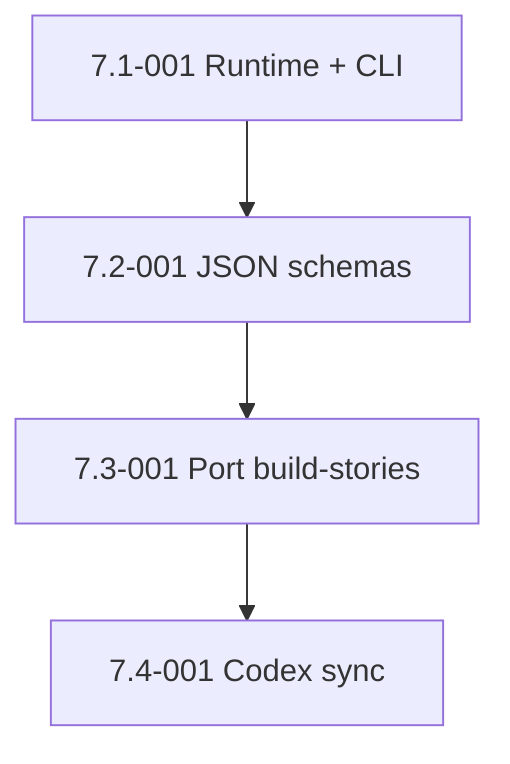

# Epic 7: External Controller and Typed Contracts

> **Status: COMPLETE** — all 4 stories merged 2026-06-12 (PRs #40, #41, #42, #43; E2E_PASS after bugfix #45). The CLI ships `build` and `validate` fully implemented (plus `sync-check`); `init`, `resume`, `status`, `state`, and `rollback` remain scaffolded stubs — see [Deferred — stubbed subcommands](#deferred--stubbed-subcommands).

## Epic Overview

**Epic ID**: Epic-07
**Track**: Roadmap (post-MVP)
**Description**: The Codex review's deepest critique: orchestration logic currently lives inside a Claude skill prompt, which means an LLM is interpreting the state machine. The orchestrator is non-deterministic by construction. This epic addresses that gap by introducing an external controller (Python or TypeScript CLI) that owns the state machine, validates every agent response against a JSON-schema contract, and turns skills into pure workers. The "thin dispatcher" pattern was a step toward this; the controller is the destination.
**Business Value**: A reliable autonomous SDLC system needs deterministic control flow. Workflows that span hours and dispatch dozens of sub-agents cannot tolerate the variance that comes from "an LLM is following a markdown playbook." With a real controller, retry semantics, idempotent transitions, and contract-validated I/O become first-class. This unlocks Path C: a framework that survives Day 2 in production, not just demo day.
**Cost**: This is a several-months investment. It is the right work if FX wants this to be a platform. It is severe overkill if the framework stays at "personal tool plus five colleagues."
**Success Metrics**:
- An `sdlc` CLI exists with subcommands: `build`, `resume`, `status`, `state`, `validate`, `rollback`. **Delivered as:** `build` and `validate` are fully implemented (plus an unlisted `sync-check`); `init`, `resume`, `status`, `state`, and `rollback` ship as scaffolded stubs that print "not yet implemented" (see [Deferred — stubbed subcommands](#deferred--stubbed-subcommands)).
- Every agent return is JSON-schema-validated before the orchestrator acts on it. Malformed returns surface as schema errors with line numbers.
- The controller, not the skill, decides retries, timeouts, and stage transitions.
- A simulated agent that returns garbage is caught by the controller, not by the next stage failing.
- The Claude skill becomes a thin invocation layer: `sdlc build $ARGUMENTS` and let the CLI do the work.

## Epic Scope

**Total Stories**: 4 | **Total Points**: 26 | **MVP Stories**: 0 (all roadmap)

## Features in This Epic

### Feature 7.1: Runtime Selection and CLI Scaffold

#### Stories

##### Story 7.1-001: Choose runtime and scaffold the CLI
**User Story**: As FX, I want to commit to Python or TypeScript for the controller and ship a working `sdlc` CLI scaffold with `init`, `version`, and `--help` so that subsequent stories have a foundation to build on.
**Priority**: P2
**Points**: 5
**Stack hint**: Python (uv + Click or Typer) or TypeScript (Bun + Commander). Decision recorded in an ADR.
**Dependencies**: Epic-04 (SQLite schema is the controller's primary data model).
**Affected files**: new `controller/` directory, `controller/pyproject.toml` or `controller/package.json`, `controller/src/sdlc/cli.py` or equivalent, new `docs/adr/001-controller-runtime.md`.

**Acceptance Criteria**:
- An Architecture Decision Record at `docs/adr/001-controller-runtime.md` captures the runtime choice with rationale. Recommended: Python + uv, on the grounds that (a) FX is a Python dev on weekends, (b) sqlite3 is in the stdlib, (c) typer + pydantic gives schema validation for free, (d) cross-platform install via uv-tool is one line.
- `sdlc --version` returns the version from `pyproject.toml`, matching the git tag.
- `sdlc --help` lists all planned subcommands with one-line descriptions, even if subcommands are unimplemented stubs.
- The CLI installs via `uv tool install .` from the `controller/` directory. Tested on macOS and WSL2.
- A new top-level `scripts/install-controller.sh` wraps `uv tool install` for users who do not have uv yet (it bootstraps uv first).

**Definition of Done**:
- [x] ADR committed.
- [x] CLI scaffold installable.
- [x] Smoke test in CI installs the CLI and runs `sdlc --version`.
- [x] Change noted in `CHANGELOG.md` under "Added".

### Feature 7.2: Typed I/O Contracts

#### Stories

##### Story 7.2-001: Define agent I/O JSON-schema contracts
**User Story**: As FX, I want every agent the orchestrator dispatches to return a JSON object that matches a published schema so that the controller can validate the response before acting on it.
**Priority**: P2
**Points**: 8
**Stack hint**: JSON schema, Pydantic (or zod for TS)
**Dependencies**: Story 7.1-001.
**Affected files**: new `controller/schemas/`, every `*-agent-prompt.md` updated to require structured output, possibly new `docs/contracts.md` documentation.

**Acceptance Criteria**:
- A schema exists for each agent type used by the orchestrator:
  - `build-agent-response.schema.json` (fields: `branch_name`, `build_status`, `commit_sha`, `pr_number` [optional], `error_summary` [optional]).
  - `coverage-agent-response.schema.json` (fields: `pr_number`, `pr_url`, `coverage_pct`, `tests_added`, `coverage_status`, `security_status`).
  - `review-agent-response.schema.json` (fields: `pr_number`, `approval_status`, `change_count`, `final_status`).
  - `merge-agent-response.schema.json` (fields: `pr_number`, `merge_status`, `merge_sha`, `merged_at`).
  - `bugfix-agent-response.schema.json` (fields: `failure_category`, `issue_number` [optional], `fix_status`, `tests_passing`, `bugs_fixed`, `tests_fixed`).
- Schemas committed in JSON-schema draft 2020-12 format.
- Agent prompts updated to require the agent to return the JSON object as the final line of its response, fenced with `<<<RESULT_JSON>>>` ... `<<<END_RESULT>>>` markers.
- The controller parses the marker block, validates against the schema, and surfaces validation errors as actionable messages (not just "validation failed").
- A test harness `controller/tests/test_schemas.py` covers: valid response passes, missing required field fails with field name, extra field is allowed (forward-compat).

**Definition of Done**:
- [x] All five schemas committed.
- [x] Agent prompts updated.
- [x] Test harness green.
- [x] Documentation in `docs/contracts.md`.
- [x] Change noted in `CHANGELOG.md` under "Added".

### Feature 7.3: Port Orchestration to Controller

#### Stories

##### Story 7.3-001: Port `build-stories` orchestration to the controller
**User Story**: As FX, I want `sdlc build` to run the full `build-stories` orchestration (discovery → cohort schedule → 4-stage execution → bugfix loop → E2E gate → summary) outside the Claude skill so that control flow is deterministic Python code, not a markdown playbook.
**Priority**: P2
**Points**: 8
**Stack hint**: Python, asyncio, subprocess to invoke Claude Code skills
**Dependencies**: Story 7.2-001 and Epic-04.
**Affected files**: `controller/src/sdlc/build.py`, `controller/src/sdlc/cohort.py`, `controller/src/sdlc/dispatch.py`, `plugins/autonomous-sdlc/skills/build-stories/SKILL.md` (drastically shortened).

**Acceptance Criteria**:
- `sdlc build [scope] [--dry-run] [--auto] [--skip-coverage] [--limit=N] [--sequential] [--coverage-threshold=N] [--skip-preflight]` accepts the same arguments the skill does today.
- The CLI:
  1. Validates the environment (preflight) by shelling out to the test command.
  2. Reads stories from the existing markdown sources (or the SQLite ledger if a prior run is being resumed).
  3. Computes cohorts.
  4. Dispatches build/coverage/review/merge agents via the Claude Code CLI (or via the Agent API directly if Anthropic exposes one).
  5. Validates every agent response against its schema; on validation failure, treats it as a build failure and routes to the bugfix loop.
  6. Writes ledger updates after every stage transition.
  7. Renders the markdown view (`.build-progress.md`).
  8. Emits cmux sidebar updates via the existing `cmux-bridge.sh` (no change to that contract).
- The skill `build-stories/SKILL.md` becomes a thin wrapper that shells out to `sdlc build $ARGUMENTS` and returns the CLI's exit code.
- A regression test verifies the CLI and the legacy skill produce the same end state for a small sample (3-story 1-epic project).

**Definition of Done**:
- Controller code committed.
- Skill wrapper committed.
- Regression test passes.
- Documentation in `docs/controller-architecture.md`.
- Change noted in `CHANGELOG.md` under "Changed" with a clear migration note.

### Feature 7.4: Migration and Codex Sync

#### Stories

##### Story 7.4-001: Codex mirror sync mechanism
**User Story**: As FX, I want the `autonomous-sdlc` plugin's shared skills to live in one source of truth, consumed by both the Claude (`claude-code-config`) and Codex (`nix-install`) repos, so that they cannot drift.
**Priority**: P2
**Points**: 5
**Stack hint**: git submodule or shared package
**Dependencies**: Story 7.3-001 (controller stabilizes the contracts before sync makes sense).
**Affected files**: new `shared-skills/` source-of-truth repo (or pick the `claude-code-config` repo to host it), sibling `nix-install` repo updates, README sections in both repos.

**Acceptance Criteria**:
- Decision recorded in ADR-002: either (a) a new third repo `fxmartin/sdlc-shared-skills` is the source of truth and both `claude-code-config` and `nix-install` consume it as a git submodule; or (b) `claude-code-config` is the source of truth and `nix-install` pulls via submodule.
- The chosen mechanism is implemented end-to-end: both consumer repos can fetch updates with one command (`git submodule update --remote`).
- The Codex extras (`check-releases`, `coverage`, `create-issue`, `create-project-summary-stats`, `plan-release-update`, `project-review`, `roast`) are removed from `commands/` in this repo and become part of the shared skill set (so they no longer have two copies).
- The release workflow (Epic-05) is updated to release the shared skill set as a versioned artifact (a git tag in the shared repo).
- Both consumer repos document the sync workflow in their READMEs.

**Definition of Done**:
- [x] ADR committed.
- [x] Sync mechanism live in both repos.
- [x] A test sync (bump a skill in source, propagate to both consumers) verified.
- [x] Change noted in `CHANGELOG.md` under "Changed".

## Story Dependencies (within Epic-07)

## Design Notes

**Why Python over TypeScript.** Strawman recommendation: Python + uv. Rationale:
- `sqlite3` in stdlib, no extra dependency.
- `pydantic` gives schema validation, env var parsing, and JSON I/O in one library.
- `typer` (or click) gives a clean CLI with auto-help.
- `uv tool install` is the lightest cross-platform install path that exists.
- FX is a Python dev on weekends; the Bun runtime guidance in CLAUDE.md is for *user projects*, not for the framework itself.
- The repo already documents Python best practices (`docs/python-best-practices.md`).

If FX prefers TS, the trade-off is: faster cold-start, better LSP/types, but a heavier install footprint (Bun or Node + tsc) and `better-sqlite3` as an additional dep.

**Why not just call the Claude Code CLI from Python.** That is exactly what the controller does. It does not replace Claude Code or the skills; it owns the orchestration layer that is currently inside the skill prompt. Skills remain Claude Code skills.

**Backward compatibility.** The skill `build-stories/SKILL.md` keeps its interface. Users still type `/build-stories` in Claude Code. The skill shells out to `sdlc build $ARGUMENTS`. Migration is invisible to end users.

**Test strategy.** The controller has its own pytest suite. The integration test layer simulates agent responses (via fixtures returning the schema'd JSON) so the test does not require running real LLMs on every CI build.

## Deferred — stubbed subcommands

Story 7.3-001 ported the orchestration that `/build-stories` actually invokes:
`sdlc build` is fully implemented (discovery → cohorts → 4-stage loop → bugfix
loop → schema-validated agent I/O → SQLite ledger writes → markdown view).
`sdlc validate` and `sdlc sync-check` are also implemented.

The remaining CLI verbs from the success metric were scaffolded under Story
7.1-001 (whose acceptance criteria explicitly allowed `--help` to list
unimplemented stubs) and **were not implemented in this epic**. As of the
Epic-07 close they still print "not yet implemented":

| Subcommand | State | Notes |
|------------|-------|-------|
| `build` | ✅ Implemented | The path `/build-stories` shells out to. |
| `validate` | ✅ Implemented | Schema validation of an agent response. |
| `sync-check` | ✅ Implemented | Codex mirror submodule sync check (7.4-001). |
| `init` | ⬜ Stub | Workspace/ledger scaffold. |
| `resume` | ⬜ Stub | Crash-resume from ledger — see caveat below. |
| `status` | ⬜ Stub | Show current run status. |
| `state` | ⬜ Stub | Inspect the persisted state machine. |
| `rollback` | ⬜ Stub | Roll a run back to a prior checkpoint. |

**Resume caveat.** Story 7.3-001's acceptance criteria describe `build` reading
"the SQLite ledger if a prior run is being resumed," and the build-stories skill
repeats this. The dedicated `sdlc resume` verb is **not** wired up. The
crash-resume capability that exists today lives in the Epic-04 bash tooling
(`sdlc-state.sh`), not in the controller CLI. Implementing `resume`/`status` in
the controller is tracked as follow-up work, not part of Epic-07's delivered
scope.

## Out-of-Scope for Epic-07

- A web dashboard for the controller (deferred).
- Multi-machine distributed orchestration (single-machine remains the design).
- A scheduling daemon ("run build-stories at 3am every night"). Use cron or LaunchAgents externally.
- Plugin marketplace for community-contributed agents.

## Epic Acceptance

Epic-07 is complete when all 4 stories meet their Definition of Done and the following hold:

- `sdlc build epic-01` runs end-to-end and produces the same output as `/build-stories epic-01` did pre-port.
- A simulated malformed agent response is caught by schema validation and routed to the bugfix loop.
- The Codex mirror in `nix-install` pulls a skill change from the shared source within one command.
- The controller test suite is green on macOS and WSL2.
