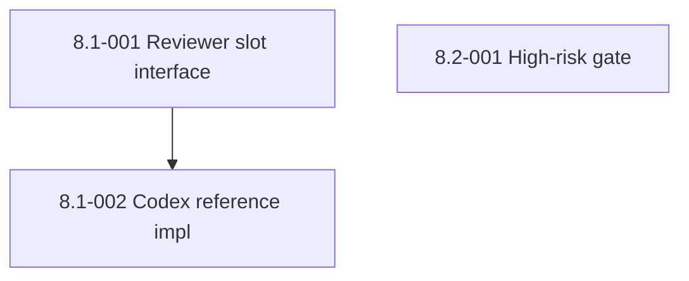

# Epic 8: Adversarial Gate and High-Risk Approval

## Epic Overview

**Epic ID**: Epic-08
**Track**: Roadmap (post-MVP)
**Description**: Two safety primitives the framework currently lacks. First, an adversarial review slot: a vendor-agnostic interface that lets any second LLM (Codex, GPT-5, Gemini, or a deterministic SAST tool) review every PR before merge. The MVP keeps adversarial review optional; this epic promotes it to mandatory and adds the registry plumbing so any reviewer can plug in. Second, a high-risk file pattern gate: any change touching auth, payments, migrations, infrastructure, secrets, or destructive shell blocks merge until a human approves, regardless of how green the rest of the pipeline is.
**Business Value**: An autonomous loop without a human-in-the-loop checkpoint for high-risk paths is a recipe for an unintended `DROP TABLE users` at 3 am. The high-risk gate is the safety valve that lets the rest of the loop run aggressively. The adversarial reviewer slot prevents vendor lock-in (today Codex; tomorrow whatever LLM proves best at adversarial review).
**Success Metrics**:
- A PR that touches `**/migrations/**` is blocked at merge until a human approves, regardless of CI/coverage/review status.
- A PR that goes through the adversarial gate receives a structured verdict (`approve`, `request_changes`, `block`) that the orchestrator parses and acts on.
- Swapping the adversarial reviewer from Codex to a different runtime requires changing only a config file, not the orchestrator code.

## Epic Scope

**Total Stories**: 3 | **Total Points**: 13 | **MVP Stories**: 0 (all roadmap)

## Features in This Epic

### Feature 8.1: Vendor-Agnostic Adversarial Reviewer Slot

#### Stories

##### Story 8.1-001: Define the adversarial reviewer slot interface
**User Story**: As FX, I want a clear interface (input, output, contract) for any adversarial reviewer so that I can plug in Codex today and swap to a different runtime tomorrow without touching the orchestrator.
**Priority**: P2
**Points**: 5
**Stack hint**: JSON schema, controller
**Dependencies**: Epic-07 (controller exists; schemas pattern established).
**Affected files**: new `controller/src/sdlc/adversarial.py`, new `controller/schemas/adversarial-reviewer-response.schema.json`, new `controller/config/adversarial-reviewers.yaml`.

**Acceptance Criteria**:
- Interface contract:
  - Input: `{ "pr_number": int, "pr_url": str, "story_id": str, "diff": str, "context": { "tests_pass": bool, "coverage_pct": float, "review_approved": bool } }`.
  - Output: `{ "reviewer_name": str, "verdict": "approve" | "request_changes" | "block", "summary": str, "findings": [{ "severity": "info" | "warn" | "error" | "critical", "category": str, "file": str, "line": int | null, "message": str }] }`.
  - Schema published as JSON-schema draft 2020-12.
- A new config file `controller/config/adversarial-reviewers.yaml` lists registered reviewers with: name, command to invoke, timeout, allowed verdicts. Example:

```yaml
reviewers:
  codex:
    command: "codex review-pr --pr-number {pr_number} --output json"
    timeout_sec: 300
    enabled: true
  gemini:
    command: "gemini-review --pr {pr_url} --format json"
    timeout_sec: 300
    enabled: false
```

- Controller method `dispatch_adversarial_review(pr_number, story_id, diff, context)` reads the config, invokes each enabled reviewer in parallel, collects verdicts, and applies a configurable consensus rule (default: any `block` blocks; otherwise majority wins).
- A test harness simulates two reviewers returning different verdicts and asserts the consensus rule.

**Definition of Done**:
- Interface and schema committed.
- Config format documented.
- Test harness green.
- Documentation in `docs/adversarial-review.md`.
- Change noted in `CHANGELOG.md` under "Added".

##### Story 8.1-002: Codex reference implementation of the slot
**User Story**: As FX, I want the Codex `autonomous-sdlc` plugin (in `nix-install`) to expose the `roast` and `project-review` skills via the adversarial reviewer slot contract so that today's Codex setup becomes the first concrete plug-in.
**Priority**: P2
**Points**: 3
**Stack hint**: TypeScript or Nix wrapper
**Dependencies**: Story 8.1-001.
**Affected files**: `nix-install` repo's Codex plugin (the wrapper script), this repo's `docs/adversarial-review.md`.

**Acceptance Criteria**:
- A wrapper command `codex-adversarial-review --pr-number <N>` exists in the Codex environment. It:
  - Fetches the PR via `gh`.
  - Invokes the Codex `roast` or `project-review` skill (configurable per repo).
  - Parses the skill's output and emits the JSON shape defined in Story 8.1-001.
- The controller config has `codex` enabled by default for FX's environment.
- The MVP framework keeps it optional. This story makes it mandatory in autonomous runs of `/build-stories` *only when configured*; users without Codex see no behavior change.
- Documentation explains how to disable the Codex reviewer if a user does not have it installed.

**Definition of Done**:
- Wrapper committed in `nix-install`.
- Controller config updated.
- End-to-end test: a PR goes through the gate, Codex returns a verdict, the orchestrator acts on it.
- Documentation updated.
- Change noted in `CHANGELOG.md` under "Added".

### Feature 8.2: High-Risk File Approval Gate

#### Stories

##### Story 8.2-001: High-risk file pattern detection and human-approval block
**User Story**: As FX, I want any PR that touches high-risk paths to block at merge until a human approves so that the autonomous loop can never silently change auth, payments, migrations, infrastructure, secrets, or destructive shell.
**Priority**: P2
**Points**: 5
**Stack hint**: bash or Python (controller), GitHub Actions, `gh`
**Dependencies**: Epic-07 (controller exists). Independent of Story 8.1-001.
**Affected files**: new `controller/src/sdlc/risk_gate.py`, new `controller/config/high-risk-patterns.yaml`, new `.github/workflows/risk-gate.yml`, merge-agent prompt updated.

**Acceptance Criteria**:
- New config `controller/config/high-risk-patterns.yaml` lists file patterns:

```yaml
high_risk_patterns:
  - "**/auth/**"
  - "**/authentication/**"
  - "**/payments/**"
  - "**/billing/**"
  - "**/migrations/**"
  - "**/.github/workflows/**"
  - "Dockerfile*"
  - "**/*.tf"
  - "**/*.tfvars"
  - "**/secrets/**"
  - "**/*.sh"  # destructive shell scripts; can be narrowed
  - "**/iam/**"
  - "**/policies/**"
```

- New workflow `.github/workflows/risk-gate.yml` runs on `pull_request`. For each changed file, checks against the patterns. If any match, the workflow:
  - Adds the `risk:high` label to the PR.
  - Adds a PR comment listing the matched files and required reviewers.
  - Fails the `risk-gate` check until a human reviewer with the `risk-approver` GitHub team membership approves.
- The merge-agent (controller side) refuses to merge any PR with the `risk:high` label until a human approval is recorded. The agent does NOT use `gh pr merge --admin` to bypass.
- A new bats test verifies pattern detection against a fixture of file paths.
- The config supports per-repo overrides via `.sdlc-risk-config.yaml` in the consumer repo (additive, not replacing).

**Definition of Done**:
- Workflow committed.
- Controller logic committed.
- Config documented.
- Bats test passes.
- A test PR touching `migrations/0001_init.sql` is correctly blocked.
- Change noted in `CHANGELOG.md` under "Added".

## Story Dependencies (within Epic-08)



Story 8.2-001 is independent of Stories 8.1-001 and 8.1-002.

## Design Notes

**Why two reviewers can disagree.** With two LLM reviewers, three verdicts are possible. The default consensus rule (`any block blocks; otherwise majority wins`) is a starting point. Users can configure stricter rules (`unanimous approve required`) per repo. The rule is in the config, not the code, so changing it does not require a release.

**Human approval mechanics.** The `risk-approver` GitHub team is documented in `docs/onboarding.md`. For solo users (FX before LTM colleagues join), the team has one member: FX. For the LTM pilot, it stays solo. Post-pilot, FX can add team members.

**False-positive cost.** A pattern like `**/*.sh` is broad. Users will hit false positives. The story includes a "can be narrowed" comment because real-world tuning happens after first contact with traffic. The point is to fail-safe, not to be perfectly precise.

**Why this is not in MVP.** Five LTM colleagues each running small side-projects do not have an "auth module under attack" risk profile yet. The high-risk gate matters most when the framework is doing more, faster, with less attention. Promote it to MVP if the pilot reveals that colleagues are using it on production-adjacent repos.

## Out-of-Scope for Epic-08

- Time-based gates ("no merges between 11 pm and 7 am"). External CI scheduling handles this.
- Reviewer rotation logic. The team list is the rotation.
- Bypass tokens or break-glass mechanisms. Add only if real operational pain emerges.
- Integration with external code-review platforms (Phabricator, Gerrit). GitHub-only for MVP and roadmap.

## Epic Acceptance

Epic-08 is complete when all 3 stories meet their Definition of Done and the following hold:

- A test PR touching `**/migrations/**` is blocked at merge.
- A test PR going through the adversarial gate gets a Codex verdict and the orchestrator acts on it.
- Swapping the adversarial reviewer from Codex to a stub returning `approve` is a one-line config change.
- Documentation in `docs/adversarial-review.md` and `docs/onboarding.md` explains the new gates.
