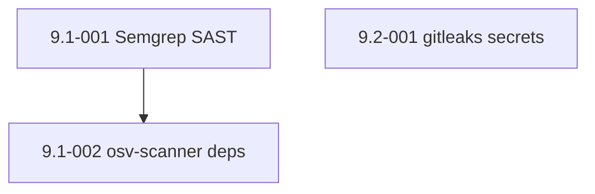

# Epic 9: Security Baked into Quality Gates

## Epic Overview

**Epic ID**: Epic-09
**Track**: Roadmap (post-MVP)
**Description**: The Codex review correctly observed that 90% coverage is necessary but not sufficient. Coverage gates do not catch SQL injection, authn bypasses, hardcoded credentials, or known-vulnerable dependencies. This epic embeds three security scans into the coverage stage, so security becomes a gate, not a follow-up: SAST (`semgrep` for cross-language, `bandit` for Python), dependency scanning (`osv-scanner`), and secrets scanning (`gitleaks`). All three run in parallel with the coverage measurement and either approve or block the PR based on severity.
**Business Value**: The framework already enforces TDD and review. Adding security to that gate set changes the framework's risk profile from "we test and review" to "we test, review, and scan." For an autonomous loop that can dispatch dozens of build agents in a night, this is non-negotiable before the framework gets used on customer-facing repos.
**Success Metrics**:
- Every PR through `/build-stories` has SAST, dependency, and secret scans run automatically.
- A PR with a critical-severity SAST finding fails the coverage stage and routes to the bugfix loop.
- A PR with a hardcoded secret is blocked at merge; the secret is never visible in the PR review surface (gitleaks runs pre-commit too).
- A PR with a known-CVE dependency at high severity blocks merge until the dependency is updated or the finding is explicitly suppressed.

## Epic Scope

**Total Stories**: 3 | **Total Points**: 10 | **MVP Stories**: 0 (all roadmap)

## Features in This Epic

### Feature 9.1: SAST Integration

#### Stories

##### Story 9.1-001: Semgrep SAST inside the coverage stage
**User Story**: As FX, I want every build to run a SAST scan as part of the coverage gate so that obvious security antipatterns (SQL injection, weak crypto, unsafe deserialization) are caught before merge.
**Priority**: P2
**Points**: 3
**Stack hint**: semgrep, bash, controller
**Dependencies**: Epic-07 (controller); Epic-04 (ledger).
**Affected files**: new `controller/src/sdlc/security_scan.py`, `plugins/autonomous-sdlc/skills/build-stories/coverage-gate-prompt.md`, new `.semgrepignore`, possibly per-repo `.sast-config.yaml`.

**Acceptance Criteria**:
- The coverage-gate stage runs `semgrep --config=p/default --config=p/owasp-top-ten --json --output=$REPORT_PATH` after coverage is measured.
- The agent parses the report and emits a `SAST_STATUS` field in its response:
  - `CLEAN` if no findings at `error` or above.
  - `WARN` if any `warning` findings exist.
  - `BLOCK` if any `error` findings exist.
- The orchestrator treats `BLOCK` as a build failure and routes to the bugfix loop (Story 5d in `build-stories`).
- A `.semgrepignore` exists with sensible defaults (test fixtures, generated files).
- Per-repo overrides: a consumer repo can ship `.sast-config.yaml` to add rulesets or to suppress findings by ID (with mandatory `reason` field).
- Performance: a 1000-file repo scan completes in under 30 seconds.

**Definition of Done**:
- Controller integration committed.
- Coverage-gate prompt updated.
- Bats test verifies a known-bad fixture (`tests/fixtures/sql-injection.py`) triggers `BLOCK`.
- Documentation in `docs/security-gates.md`.
- Change noted in `CHANGELOG.md` under "Added".

##### Story 9.1-002: Dependency scan with osv-scanner
**User Story**: As FX, I want every build to check the project's dependency tree against the OSV vulnerability database so that PRs that introduce known-vulnerable libraries are blocked.
**Priority**: P2
**Points**: 3
**Stack hint**: osv-scanner, controller
**Dependencies**: Story 9.1-001 (security_scan module exists).
**Affected files**: `controller/src/sdlc/security_scan.py`, coverage-gate prompt.

**Acceptance Criteria**:
- Coverage gate runs `osv-scanner --lockfile=auto --format=json --output=$REPORT_PATH .` (auto-detects `package-lock.json`, `uv.lock`, `poetry.lock`, `go.sum`, `Cargo.lock`).
- The agent emits a `DEP_SCAN_STATUS` field:
  - `CLEAN` if no findings.
  - `WARN` if low/moderate severity findings.
  - `BLOCK` if high or critical severity findings.
- The orchestrator routes `BLOCK` to bugfix per the same path as SAST.
- The bugfix agent's prompt is updated to handle dependency-vulnerability remediation: it knows how to bump a single dep, run tests, and confirm the vulnerability is gone.
- A suppression mechanism: `.dep-scan-suppressions.yaml` per repo, listing OSV IDs with mandatory `reason` and `expires` fields. CI fails when a suppression is past its expiry date.

**Definition of Done**:
- Scanner integration committed.
- Bugfix agent updated.
- Bats test verifies a fixture project with a known-vulnerable lockfile triggers `BLOCK`.
- Suppression mechanism documented.
- Change noted in `CHANGELOG.md` under "Added".

### Feature 9.2: Secrets Scanning

#### Stories

##### Story 9.2-001: Gitleaks secrets scan on every PR
**User Story**: As FX, I want a secrets scanner to fail every PR that introduces a credential, API key, or token so that the framework can never autonomously commit a secret.
**Priority**: P2
**Points**: 4
**Stack hint**: gitleaks, GitHub Actions, pre-commit hook
**Dependencies**: Epic-02 (CI workflow). Independent of Stories 9.1-001 and 9.1-002.
**Affected files**: new `.gitleaks.toml`, `.github/workflows/ci.yml` (add gitleaks job), new `.pre-commit-config.yaml` with gitleaks hook, `docs/security-gates.md`.

**Acceptance Criteria**:
- `.gitleaks.toml` configures detection rules: default ruleset plus allowlist for known-safe patterns (e.g., `.env.example` files, fixtures).
- New CI job `secrets-scan` runs `gitleaks detect --no-banner --redact` on every PR. The job runs *before* the build job to fail fast on credential leaks.
- A pre-commit hook (via pre-commit framework) runs the same scan locally before commit. Documented as opt-in in `docs/onboarding.md`.
- Findings are redacted in CI output (no secret values logged).
- If a secret is found, the PR is blocked. The author must rotate the secret AND scrub it from history (force-push with cleaned history, or revert + remove). The framework does not auto-rotate.
- A test fixture (`tests/fixtures/leaked-key.txt`) contains a deliberate test secret; the bats test verifies gitleaks catches it.

**Definition of Done**:
- Config and workflow committed.
- Pre-commit config committed.
- Bats test passes.
- Documentation in `docs/security-gates.md` explains how to handle a real find.
- Change noted in `CHANGELOG.md` under "Added".

## Story Dependencies (within Epic-09)

Story 9.2-001 is independent of the others and can ship first if Epic-02 is the only prerequisite.

## Design Notes

**Why not bandit + semgrep both?** Semgrep covers Python via `p/python`. Adding bandit duplicates effort for the same language. Stick with semgrep as the SAST surface; if Python-specific gaps surface, add bandit later.

**Why osv-scanner over snyk or dependabot?** Open-source, no API key needed, no third-party telemetry, runs locally and in CI. Dependabot is GitHub-native and complements (it opens PRs to bump deps); osv-scanner is the gate that catches PRs introducing new vulnerabilities. Both are useful; this epic introduces osv-scanner first because it is the gate. Dependabot can be enabled separately.

**Suppression is a foot-gun.** Allowing suppressions risks "every finding gets suppressed." The `reason` and `expires` fields force suppressions to be intentional and time-boxed. CI fails when a suppression expires, forcing re-review.

**Performance budget.** Security scans add to coverage-gate runtime. Budget: 30 seconds for SAST on a typical repo, 10 seconds for dep scan, 5 seconds for secrets scan. Total +45 seconds per build agent. With 5 parallel agents that is 5 * 45 = 225 agent-seconds, which is acceptable.

**Why secrets scanning has its own job (not inside coverage).** Secrets must be caught before any other CI step runs (so they are not echoed in logs). Running gitleaks as the first CI job is standard practice. This is the one security check that pulls out of the coverage gate.

## Out-of-Scope for Epic-09

- Container image scanning (Trivy or Grype). Add when Dockerfile changes become routine in user projects.
- License compliance scanning (FOSSA, ScanCode). Add when LTM expands the framework to customer repos with strict license policies.
- IAST or DAST (runtime testing). E2E gate covers some of this; full DAST is a separate platform.
- Threat modeling automation. Manual still.

## Epic Acceptance

Epic-09 is complete when all 3 stories meet their Definition of Done and the following hold:

- A test PR with a deliberate SQL-injection pattern triggers a `BLOCK` from the SAST scanner.
- A test PR with a known-vulnerable lockfile entry triggers a `BLOCK` from the dependency scanner.
- A test PR with a deliberate API-key string triggers a block from gitleaks before any other CI job runs.
- The bugfix agent successfully remediates the SAST and dependency cases in a sample run.
- Documentation in `docs/security-gates.md` is complete.
