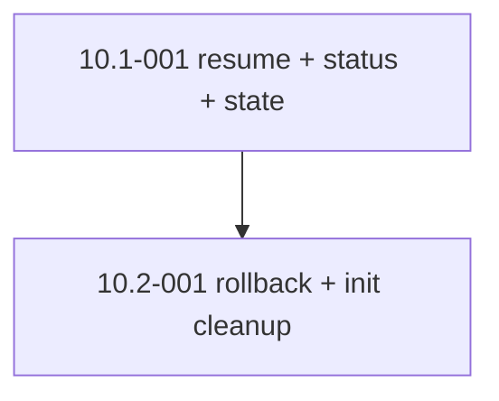

# Epic 10: Controller Hardening — Resume, Observability, Rollback

> **Status: COMPLETE** (2026-06-20) — both stories merged: 10.1-001 `resume`/`status`/`state` + web `dashboard` (#66, #67, #70) and 10.2-001 `rollback` + `init` removal (#71). No `sdlc` verb prints "not yet implemented" anymore. Created 2026-06-15 to complete the CLI verbs Epic-07 shipped as scaffolded stubs (see [Epic-07 Deferred — stubbed subcommands](./epic-07-external-controller.md#deferred--stubbed-subcommands)).

## Epic Overview

**Epic ID**: Epic-10
**Track**: Roadmap (post-MVP)
**Description**: Epic-07 delivered the deterministic controller and ported the `build` orchestration that `/build-stories` invokes, plus `validate` and `sync-check`. The remaining CLI verbs — `init`, `resume`, `status`, `state`, `rollback` — were scaffolded under Story 7.1-001 and ship as stubs that print "not yet implemented." This epic implements the verbs that carry real operational value for long-running unattended batches and retires the one that is redundant. It does not add new surface area; it finishes the surface Epic-07 declared.
**Business Value**: The controller's headline promise is surviving Day 2 in production — workflows that span hours and dispatch dozens of sub-agents. Crash-resume, run observability, and checkpoint rollback are exactly the capabilities that make an unattended overnight batch trustworthy. Today crash-resume exists only in the Epic-04 bash tooling (`sdlc-state.sh`), so the controller is not yet the single source of truth for recovery it was designed to be. This epic closes that gap.
**Cost**: Small relative to Epic-07. The state machine, ledger, and schemas already exist; this is wiring controller verbs onto data structures that are already persisted. Estimated 13 points across 2 stories.
**Success Metrics**:
- `sdlc resume` picks up an interrupted run from the SQLite ledger at the exact failed stage, with branch, PR number, and attempt count intact — matching MVP criterion #5, controller-native (not via the bash fallback).
- `sdlc status` reports the current run's stage progress (per-story stage, pass/fail counts) without reading the markdown view.
- `sdlc state` dumps the persisted state machine for a run for debugging.
- `sdlc rollback` returns a run to a prior ledger checkpoint and the next `build`/`resume` proceeds from there.
- `init` is either implemented with a clear purpose distinct from `build`'s auto-create, or removed from the CLI and its `--help` entry, so no verb remains that prints "not yet implemented."

## Epic Scope

**Total Stories**: 2 | **Total Points**: 13 | **MVP Stories**: 0 (all roadmap)

## Features in This Epic

### Feature 10.1: Crash Recovery and Observability

#### Stories

##### Story 10.1-001: Implement controller-native resume, status, and state
**User Story**: As FX, I want `sdlc resume` to recover an interrupted build from the ledger, and `sdlc status`/`sdlc state` to report what the controller is doing, so that an unattended overnight batch is recoverable and inspectable without dropping to the bash tooling.
**Priority**: P2
**Points**: 8
**Stack hint**: Python; reuse `controller/src/sdlc/ledger_view.py` (`Ledger`, `default_db_path`) and the existing stage/transition model from `build.py`.
**Dependencies**: Epic-07 (Stories 7.1-001, 7.3-001) and Epic-04 (ledger schema).
**Affected files**: `controller/src/sdlc/cli.py` (replace the `resume`/`status`/`state` stub bodies), likely a new `controller/src/sdlc/resume.py` and `controller/src/sdlc/status.py`, `controller/tests/` (new tests), `docs/controller-architecture.md`.

**Acceptance Criteria**:
- `sdlc resume [scope]` reads the most recent incomplete run for the scope from the ledger, recomputes the remaining queue, and re-enters the 4-stage loop at the exact stage each story was interrupted in (branch, PR number, and attempt count preserved). Completed stories are not rebuilt.
- Resuming a run with no incomplete stories is a no-op that reports "nothing to resume" and exits 0.
- `sdlc status` prints, for the active or most recent run: scope, run id, per-story current stage, and aggregate counts (completed / failed / blocked / in-progress). It reads the ledger directly, not `.build-progress.md`.
- `sdlc state` dumps the persisted state-machine rows for a run (story id, stage, status, attempt, branch, pr) in a stable, greppable format for debugging.
- A test simulates an interrupted run (ledger left mid-stage via fixtures) and asserts `resume` continues from the right stage and `status` reports the interrupted state correctly.
- Behaviour parity check: the controller `resume` reaches the same end state as the legacy `sdlc-state.sh` resume path for a small sample run.

**Definition of Done**:
- [x] `resume`, `status`, `state` implemented (no remaining "not yet implemented" output for these three).
- [x] pytest coverage for interrupted-run resume and status reporting, green on macOS and WSL2.
- [x] `docs/controller-architecture.md` updated; the Epic-07 stub table updated to mark these three implemented.
- [x] Change noted in `CHANGELOG.md` under "Added".

### Feature 10.2: Rollback and Stub Cleanup

#### Stories

##### Story 10.2-001: Implement rollback and resolve the init stub
**User Story**: As FX, I want `sdlc rollback` to return a run to a prior checkpoint, and the `init` stub either given a real purpose or removed, so that no controller verb is a dead end and a bad batch can be unwound.
**Priority**: P2
**Points**: 5
**Stack hint**: Python; checkpoint semantics on the existing ledger. Decide `init` fate in a short ADR addendum or inline note.
**Dependencies**: Story 10.1-001 (resume/state land the read-side machinery rollback builds on).
**Affected files**: `controller/src/sdlc/cli.py` (replace `rollback` and `init` stub bodies, or remove `init`), likely `controller/src/sdlc/rollback.py`, `controller/tests/`, `docs/controller-architecture.md`, possibly `docs/adr/001-controller-runtime.md` (addendum on `init`).

**Acceptance Criteria**:
- `sdlc rollback [run] --to <checkpoint>` returns the named run to the specified prior ledger checkpoint; a subsequent `sdlc build`/`sdlc resume` proceeds from the rolled-back state.
- `rollback` refuses (non-zero exit, clear message) when the target checkpoint does not exist or would discard a merged PR, so it cannot silently lose committed work.
- A test rolls a multi-stage run back one checkpoint and asserts the next `resume` rebuilds only the rolled-back stories.
- `init` is resolved: either it scaffolds something `build` does not already auto-create (documented purpose), or it is removed from the CLI and `--help`. Either way, `sdlc --help` lists no verb whose body prints "not yet implemented."
- The Epic-07 stub table is updated to reflect the final state of all eight verbs.

**Definition of Done**:
- [x] `rollback` implemented with guard rails; `init` resolved (removed as redundant with `build`'s auto-create).
- [x] pytest coverage for rollback and its guard rails, green on macOS and WSL2.
- [x] Epic-07 stub table and `docs/controller-architecture.md` updated; `init` removal recorded as an ADR-001 addendum.
- [x] Change noted in `CHANGELOG.md` under "Added" (rollback) and "Removed" (init).

## Story Dependencies (within Epic-10)

## Design Notes

**No new data model.** Everything this epic needs is already persisted by Epic-04's ledger and written by Epic-07's `build`. The work is read-side (`status`, `state`), re-entry (`resume`), and checkpoint manipulation (`rollback`) on existing rows — not new schema.

**Why `resume` still matters when bash already does it.** The controller was meant to be the single deterministic owner of the state machine. Leaving crash-resume in `sdlc-state.sh` splits that ownership and means an unattended batch driven by `sdlc build` cannot recover itself without a human invoking the bash tool. Consolidating into `sdlc resume` is the point.

**`init` is suspect.** `build` already creates the ledger via `default_db_path()`, so a separate `init` may be redundant. The story explicitly allows removing it rather than inventing a purpose — finishing the surface honestly includes deleting dead verbs.

## Out-of-Scope for Epic-10

- New CLI verbs beyond the five Epic-07 stubs.
- A web dashboard or TUI for run status (still deferred, as in Epic-07).
- Multi-machine / distributed orchestration.
- Replacing the Epic-04 bash `sdlc-state.sh` tooling — it can remain as a fallback; this epic only makes the controller self-sufficient.

## Epic Acceptance

Epic-10 is complete when both stories meet their Definition of Done and:

- `sdlc --help` lists no verb that prints "not yet implemented."
- An interrupted `sdlc build` is recoverable end-to-end via `sdlc resume`, verified against a fixture-simulated crash.
- `sdlc rollback` unwinds a run to a prior checkpoint with guard rails against discarding merged work.
- The Epic-07 stub table is updated to its final post-hardening state.
- The controller test suite is green on macOS and WSL2.
